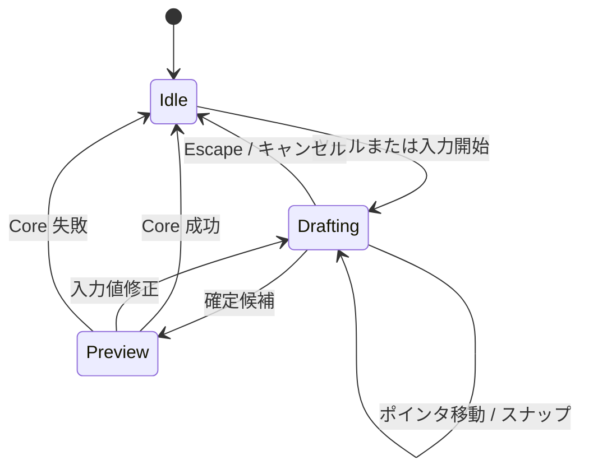

# Canvas components

キャンバス領域は、ツール選択、Core スナップショットの描画、入力の解釈、注記・拘束の一時操作を担当する。確定状態は `LeatherCanvasView` が保持せず、親の表示モデルと feature action から受け取る。

| コンポーネント | Swift の実装 | 対応する Tauri 実装 | 役割 |
| --- | --- | --- | --- |
| CADCanvas | `Features/Canvas/Components/CADCanvas.swift` | `src/features/canvas/components/CadCanvas.tsx` | SwiftUI と AppKit キャンバスを接続する。Tauri は `<canvas>` と DOM の入力を同じ表示責務で扱う。 |
| LeatherCanvasView | `Features/Canvas/Components/LeatherCanvasView*.swift` | `CadCanvas.tsx` / `canvasRendering.ts` | 図形、選択、注記、拘束マーカー、スナップを描画し、入力を action へ渡す。 |
| CADToolbar | `Features/Canvas/Components/CADToolbar.swift` | `src/features/canvas/components/CadToolbar.tsx` | 現在のツール、レイヤー、表示補助、ズーム、編集操作をまとめる。 |
| ToolPalette | `Features/Canvas/Components/ToolPalette.swift` | `src/features/canvas/components/ToolPalette.tsx` | 作図・派生・拘束・寸法・計測ツールをグループ表示する。 |
| ToolIcon / PaletteToolButton | `Shared/Components/DesignSystem.swift` / `ToolPalette.swift` | `ToolIcon.tsx` / `ToolPalette.tsx` | ツールの視覚表現と選択操作を共通化する。 |
| CanvasStatusBar | `Features/Canvas/Components/CanvasStatusBar.swift` | `src/features/canvas/components/CanvasStatusBar.tsx` | カーソル位置、表示倍率、スナップなどの状態を表示する。 |
| CanvasContextMenu | `Features/Canvas/Components/CanvasContextMenu.swift` と `LeatherCanvasView` | `src/features/canvas/components/CanvasContextMenu.tsx` | キャンバス位置と選択対象に応じた操作を提示する。macOS は AppKit のメニューを使う。 |
| CanvasInlineTextEditor | `CanvasInlineTextEditorController.swift` / `LeatherCanvasView.InlineEditor.swift` | `CadCanvas.tsx` 内の `canvas-inline-text-editor` | 自由テキストをキャンバス上で一時編集する。確定時だけ Core action を呼ぶ。 |
| CanvasAnnotationRenderer | `CanvasAnnotationRenderer.swift` / `LeatherCanvasView.*Annotations.swift` | `canvasRendering.ts` | 計測・寸法・拘束の注記と操作用の表示を組み立てる。 |

## 入力と表示の流れ

### 実装上の注意

- 画面倍率とデバイスのピクセル倍率を混同しない。
- ヒットテストの許容値は表示倍率に合わせ、ズームしても操作しやすさを維持する。
- 入力中の候補は Core の確定状態と分離し、キャンセル時にドキュメントを変更しない。

