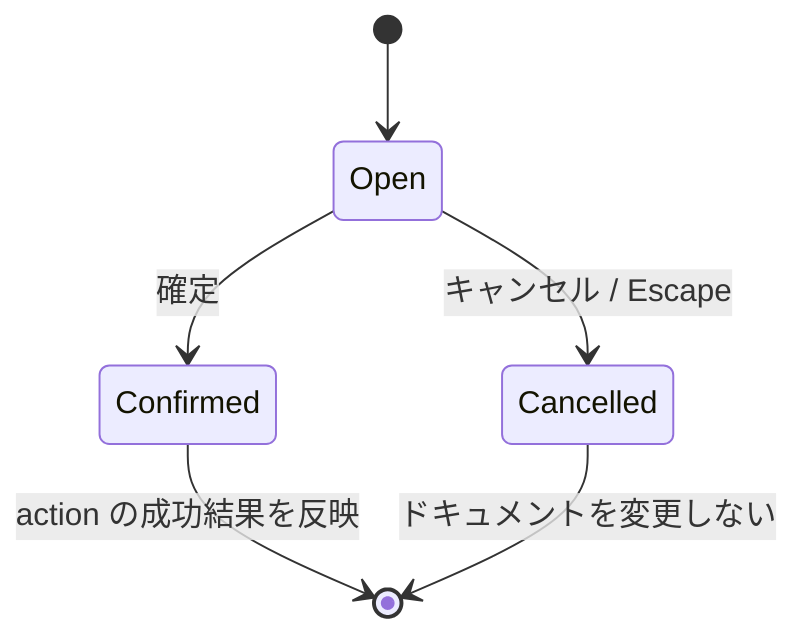

# Dialog and feedback components

ダイアログ、シート、バナーは、操作を中断せずに確認・入力・結果通知を行う。OS 標準 UI に委譲する部品は macOS 固有の表示形式を持つが、確認する内容と action の意味は Tauri と揃える。

| コンポーネント | Swift の実装 | 対応する Tauri 実装 | 役割 |
| --- | --- | --- | --- |
| ConstraintValueDialog / DerivedValueDialog | `Features/Constraints/Components/ValueEntryDialogs.swift` | `ConstraintValueDialog.tsx` / `DerivedValueDialog.tsx` | 拘束、オフセット、フィレットの固定値・パラメータ参照を入力する。 |
| AngleConstraintOverlay | `Features/Constraints/Components/AngleConstraintOverlay.swift` | `CadCanvas.tsx` 内の入力表示 | 角度拘束の入力候補をキャンバス上に表示する。 |
| OutputDialog | `Features/Output/Components/OutputDialog.swift` | `OutputDialog.tsx` / `PDFExportDialog.tsx` / `DirectPrintDialog.tsx` | PDF 出力と直接印刷の設定、警告、完了通知を扱う。 |
| RecoveryChooserDialog | `Features/Recovery/Components/RecoveryChooserDialog.swift` | `RecoveryChooserDialog.tsx` | 復旧候補の復元、破棄、Finder での表示、延期を選択する。 |
| RecoverySaveFailureBanner | `Features/Recovery/Components/RecoverySaveFailureBanner.swift` | `RecoverySaveFailureBanner.tsx` | 復旧保存の失敗と再試行・詳細・閉じる操作を表示する。 |
| OpenSourceLicensesDialog | `App/KawaCADLicensesPanel.swift` | `OpenSourceLicensesDialog.tsx` | 同梱した依存ライセンス通知を表示する。 |
| KawaCADAboutPanel | `App/KawaCADAboutPanel.swift` | `adapters/nativeMenuAdapter.ts` の About 項目 | OS の About UI を表示する。任意の操作は別メニューへ置く。 |

### 確認ダイアログの状態

