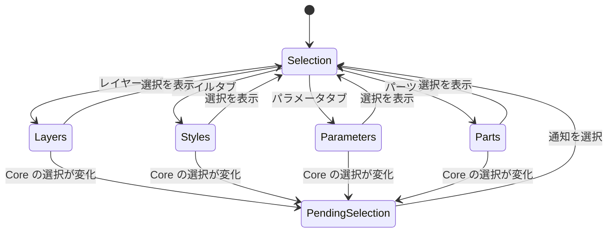

# Inspector components

Inspector は Core のスナップショットを編集対象ごとの表示モデルへ投影し、ユーザー操作を feature action に渡す。Inspector 内の検索・展開・選択タブは UI が所有する表示状態であり、`.kawa` へ保存しない。

| コンポーネント | Swift の実装 | 対応する Tauri 実装 | 役割 |
| --- | --- | --- | --- |
| WorkspaceInspector / InspectorPanel | `Features/Inspector/Components/WorkspaceInspector.swift` / `InspectorPanel.swift` | `WorkspaceInspector.tsx` / `InspectorPanel.tsx` | Docked / compact 表示とタブの composition root。 |
| InspectorSection / InspectorDisclosureRow | `Shared/Components/DesignSystem.swift` / `InspectorSelectionEditors.swift` | `src/shared/components/InspectorPrimitives.tsx` | セクション見出しと展開行の共通表示。 |
| InspectorSelectionTab | `Features/Inspector/Components/InspectorSelectionTab.swift` | `InspectorSelectionTab.tsx` | 選択中の図形、拘束、計測、自由テキスト、縫い始め点を表示する。 |
| Selection editors | `Features/Inspector/Components/InspectorSelectionEditors.swift` | `InspectorSelectionEditors.tsx` | `SelectedConstraintEditor`、`SelectedMeasurementEditor`、`SelectedStitchStartPointEditor`、`FreeTextEditor`、`MultiSelectionSummary`、`EntityEditor`、`DerivedElementEditor`、`RoundHoleEditor`、`EntityGeometryEditor` を提供する。 |
| InspectorLayerTab / LayerEditorRow | `Features/Inspector/Components/InspectorLayerTab.swift` / `LayerEditorRow.swift` | `InspectorLayerTab.tsx` | レイヤーの選択、表示・出力対象、名前、スタイルを編集する。 |
| InspectorStylesTab | `Features/Inspector/Components/InspectorStylesTab.swift` | `InspectorStylesTab.tsx` | 共有線種を一覧し、各フィールドを編集する。 |
| InspectorParametersTab / ParameterEditor | `Features/Inspector/Components/InspectorParametersTab.swift` / `InspectorEditors.swift` | `InspectorParametersTab.tsx` / `InspectorSelectionEditors.tsx` | パラメータの値と参照元を編集する。 |
| InspectorPartsTab / PartEditor | `Features/Inspector/Components/InspectorPartsTab.swift` / `InspectorSelectionEditors.swift` | `src/features/parts/components/InspectorPartsTab.tsx` / `InspectorPartEditors.tsx` | パーツの配置、整列、ライブラリ操作を編集する。 |

### タブ切り替え

タブを切り替えても Core の選択状態は変更しない。別タブで選択が変わった場合は、選択タブへ戻れる通知だけを表示する。

