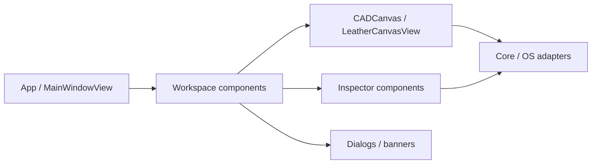

# KawaCADApp

KawaCAD の macOS UI は、SwiftUI の画面部品と AppKit のキャンバス・OS 連携を組み合わせて構成する。

この DocC カタログは、表示責務を持つコンポーネントを feature ごとに整理した開発者向け索引である。画面の外部仕様は [`docs/spec/ui-ux-spec.md`](../../../../../docs/spec/ui-ux-spec.md)、Swift/Tauri 間の対応は [`component-correspondence.md`](../../../../../docs/design/ui-architecture/component-correspondence.md) を参照する。

実際の SwiftUI 部品を確認する場合は、`swift run KawaCAD --component-gallery` で `ComponentGalleryView` を起動する。DocC は責務と入力境界の索引、ComponentGallery は fixture state による描画確認を担当する。

## UI の境界

コンポーネントは Core の確定状態を直接変更せず、feature の action と表示用モデルを介して画面へ投影する。キャンバスの入力と描画だけは AppKit の `NSView` を使い、SwiftUI の画面ツリーから `CADCanvas` に接続する。

## Topics

- <doc:Components>
- <doc:CanvasComponents>
- <doc:InspectorComponents>
- <doc:DocumentComponents>
- <doc:WorkspaceComponents>
- <doc:DialogComponents>
- <doc:SharedComponents>
- <doc:ComponentGallery>
