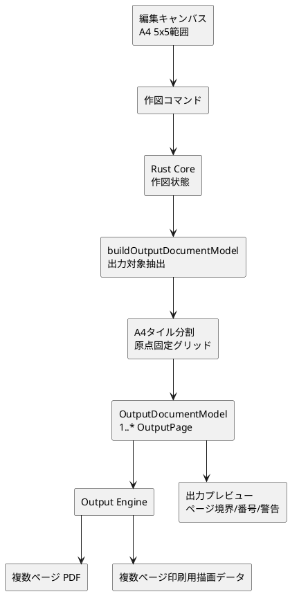
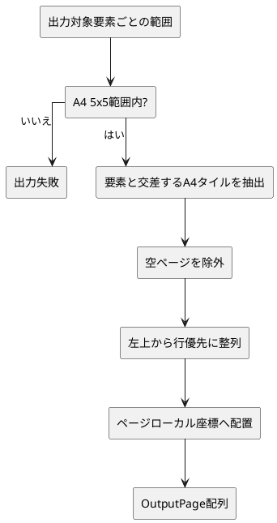

# A4タイル対応キャンバス拡張 概略設計

## 1. 目的

本書は、A4単ページ前提のキャンバスと出力を、A4外への作図とA4単位の複数ページ出力へ拡張するための概略設計を整理する。

扱うのは、作図キャンバス、A4グリッド、出力用中間表現、PDF出力、直接印刷、出力プレビューの責務分担である。個別の型定義、関数分割、描画API呼び出しの詳細は扱わない。

## 2. 対象範囲

| 扱うもの | 扱わないもの |
| --- | --- |
| A4外へ作図できるキャンバス | 任意サイズキャンバス |
| 原点固定のA4 5x5グリッド | 5x5以外の範囲設定UI |
| A4単位の複数ページ出力 | A3、Letter、任意用紙 |
| ページ境界またぎ警告 | 手動ページ配置 |
| 最小限の貼り合わせガイド | 重なり代付き出力 |
| Core結果に基づく出力プレビュー | ページ別プレビューUI |

## 3. 基本方針

- 編集キャンバスは、原点ページを中心にA4 5x5相当の範囲まで作図できる。
- 編集キャンバス上のA4グリッドは、初期実装では縦A4固定とする。
- 出力時は、出力設定の用紙向きに従ってA4グリッドを扱う。
- Core は、出力対象の各要素が交差するA4ページだけを `OutputPage` として生成し、空ページは出力対象にしない。
- `OutputPage` 内の座標は、ページ中心を原点にしたページローカル座標とする。
- ページ順は、左上から右方向、次の行へ進む行優先とする。
- 出力対象がA4 5x5グリッドの範囲外に出る場合は、出力失敗として扱う。
- ページ境界をまたぐ図形がある場合は警告し、利用者が続行できる。
- Output Engine はページ領域で描画をクリップし、初期実装では図形をページ境界で幾何分割しない。
- 貼り合わせガイドは出力時に生成する補助要素であり、`.lcraft` には保存しない。

## 4. 全体フロー

## 5. 責務分担

| 領域 | 責務 |
| --- | --- |
| macOS UI | A4外入力、A4グリッド表示、出力設定、警告表示、出力プレビュー |
| Core | 作図状態の保持、出力対象抽出、A4タイル分割、ページ順、警告、失敗判定 |
| Output Engine | `OutputDocumentModel` からPDF/印刷用データを生成し、ページ領域で描画をクリップする |
| `.lcraft` | 作図内容、レイヤー、拘束などを保存する。ページ分割結果や貼り合わせガイドは保存しない |

## 6. ページ分割

Core は、印刷対象レイヤーの出力図形と寸法ラベルを出力対象要素として扱う。生成するページ集合は、各出力対象要素が交差するA4タイルの和集合とし、出力対象要素を含まない空ページは出力しない。50mmガイドと貼り合わせガイドはページごとに付与する出力補助であり、ページ集合の算出には使わない。

ページ境界またぎ警告は、出力図形の外接範囲が複数A4ページに交差する場合に返す。

## 7. 参照

- `docs/spec/functional-spec.md`
- `docs/design/internal-interface-spec.md`
- `docs/spec/file-format-spec.md`
- [`docs/design/output/overview.md`](../output/overview.md)
