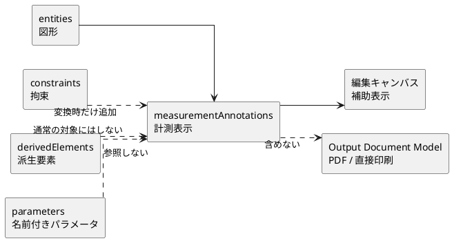
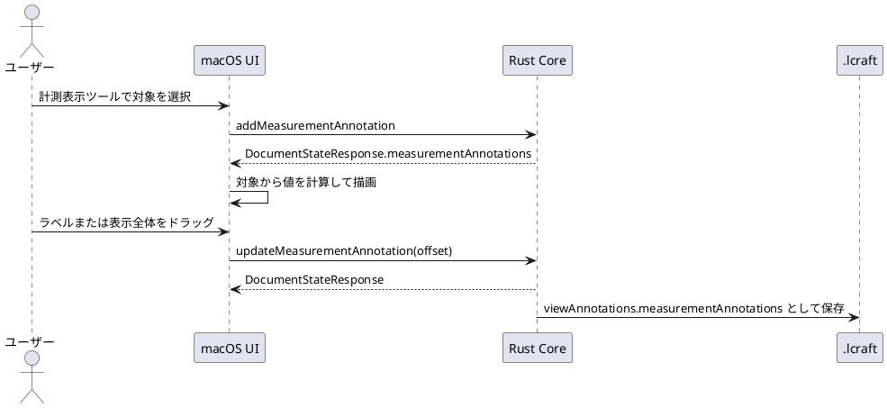
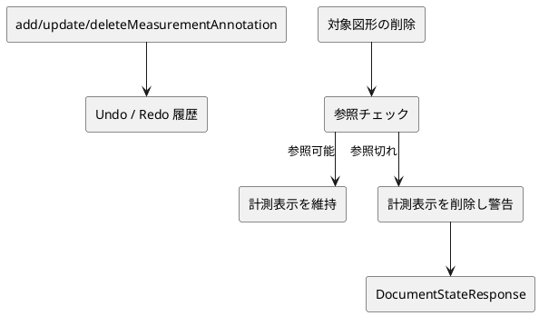
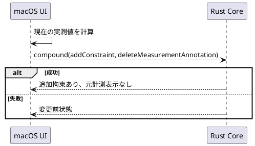

# 計測表示

## 1. 目的

方眼紙だけでは読み取りにくい寸法や角度を、形状を駆動しない補助表示としてキャンバス上に置けるようにする。

計測表示は、人が確認するための視覚補助であり、図形、派生要素、拘束、パラメータとは分離する。値は保存せず、参照対象から都度計算する。

計測値と、寸法線・投影線・共有端点・角度弧に必要な意味上の基準点は
Core が現在形状から評価する。UI は Core が返す mm 座標の解決済み投影へ
保存済み表示オフセットを適用し、見た目と重なり回避だけを扱う。
寸法拘束も同じ投影モデルを使い、対象レイヤーまたは所属パーツが
非表示の場合の表示可否も Core が返す。

## 2. 責務分離

| 項目 | 扱い |
| --- | --- |
| 図形への影響 | なし |
| 拘束状態への影響 | なし |
| 自由度評価への影響 | なし |
| 保存 | `.lcraft` の補助情報領域に保存 |
| 出力 | V1 では PDF/印刷へ出力しない |

## 3. データの流れ

## 4. 保存内容

計測表示は次の情報だけを持つ。

| フィールド | 目的 |
| --- | --- |
| `id` | 計測表示の識別 |
| `kind` | 計測表示種別 |
| `targets` | 値を計算する参照対象 |
| `labelOffsetMm` | ラベル位置の調整量 |
| `overallOffsetMm` | 寸法線または角度弧全体の調整量 |
| `visible` | 表示可否 |

値そのものは保存しない。対象図形が変わった場合は、次回表示時に再計算する。

## 5. 対象種別

| kind | 対象 |
| --- | --- |
| `distance` | 2点 |
| `segmentLength` | 線分または中心線 |
| `angle` | 共有端点を持つ2線分 |
| `radius` | 円または円弧 |
| `diameter` | 円または円弧 |
| `arcSweepAngle` | 円弧 |

## 6. Undo/Redo と参照切れ

計測表示の追加、更新、削除は `DocumentCommand` として扱い、Undo/Redo 対象にする。

参照対象が削除された、または対象種別が不正になった計測表示は、図形本体の復元や拘束評価を止めない。Core は該当計測表示を整理し、警告を返す。

## 7. 拘束への変換

数値を編集したい場合、計測表示自体を数値編集するのではなく、対応する寸法拘束または角度拘束へ変換する。

変換は1つの Undo/Redo 単位にする。変換に失敗した場合は計測表示を残し、既存状態を変更しない。
