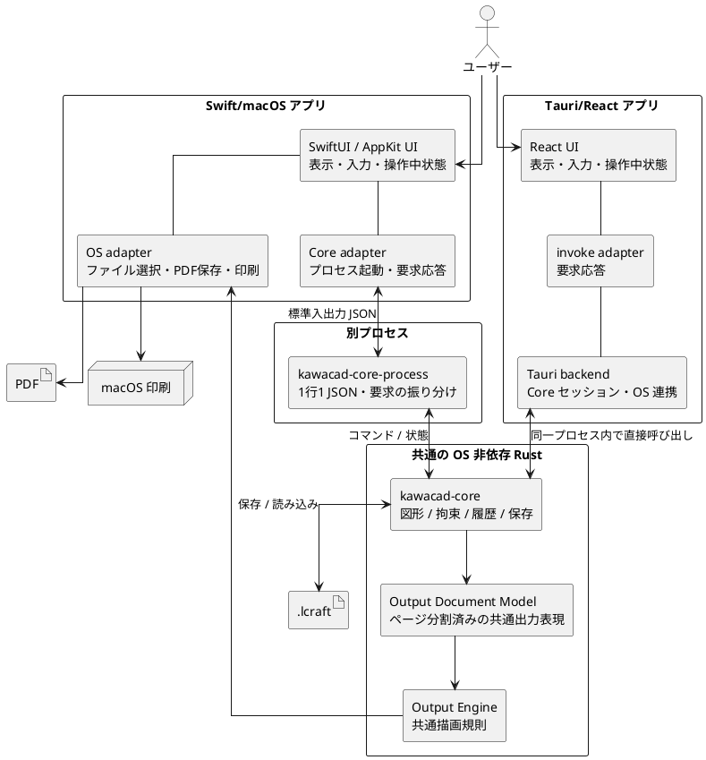
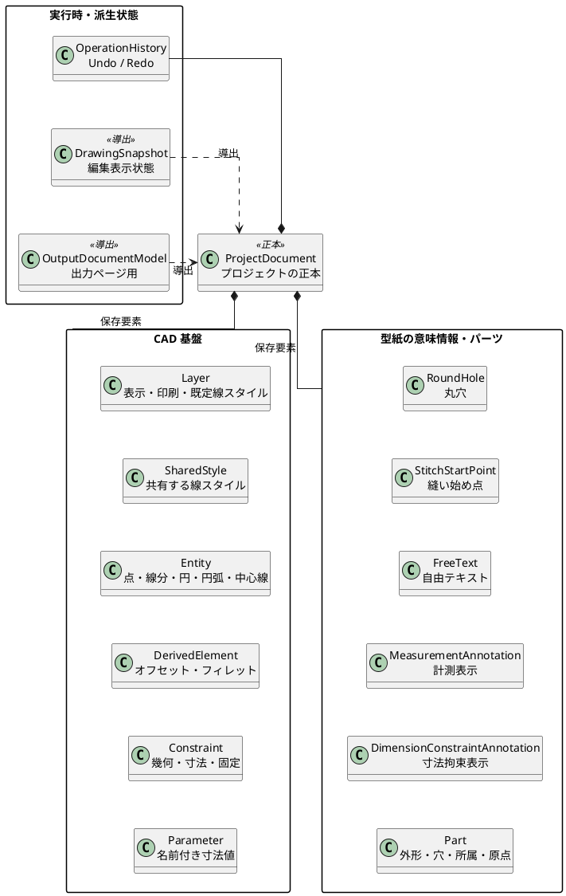
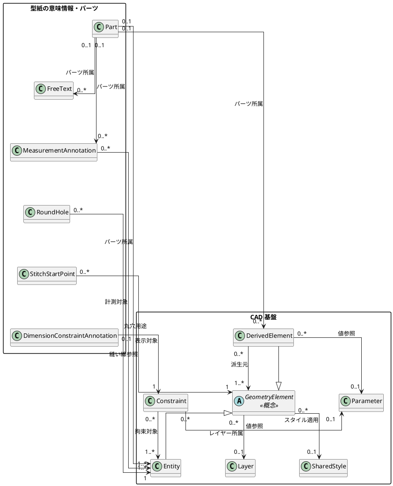
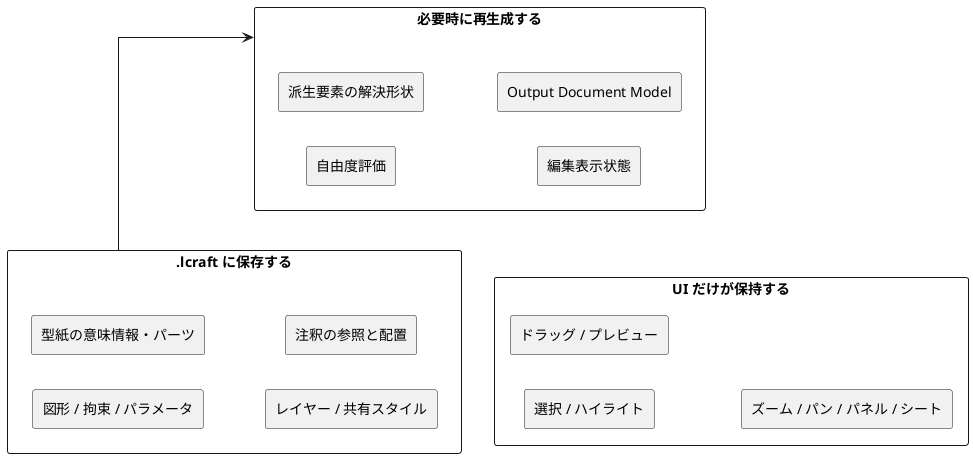
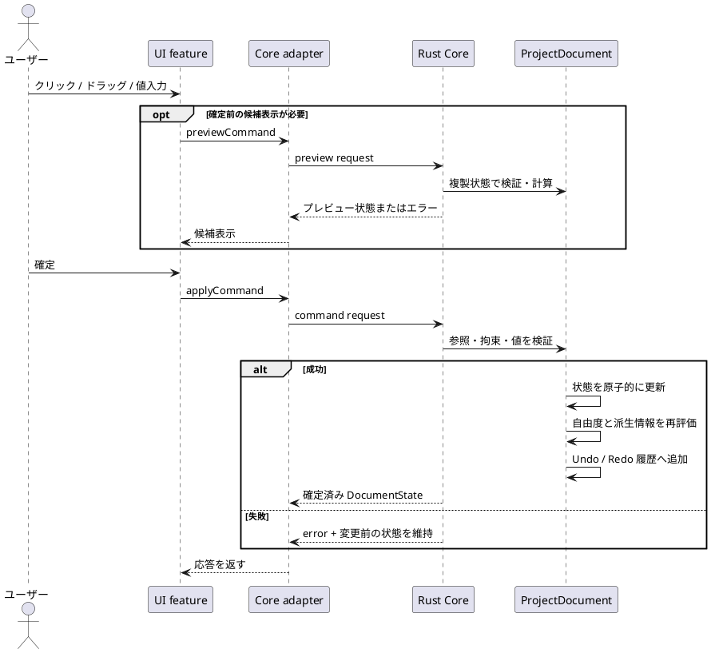
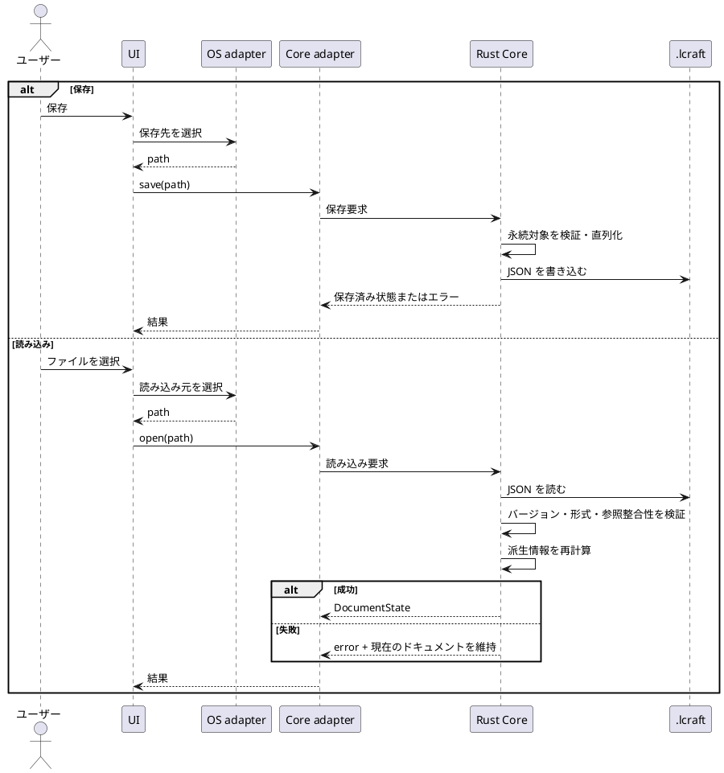
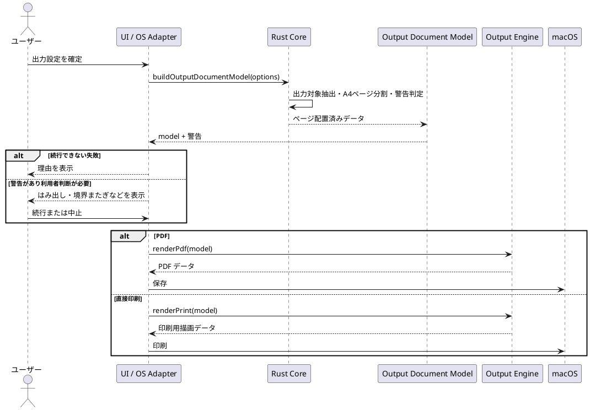
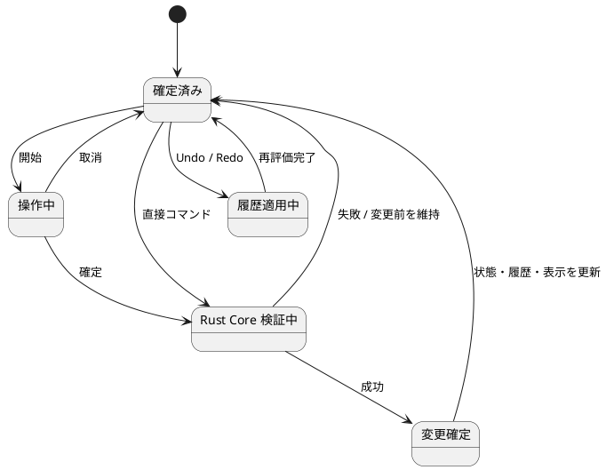
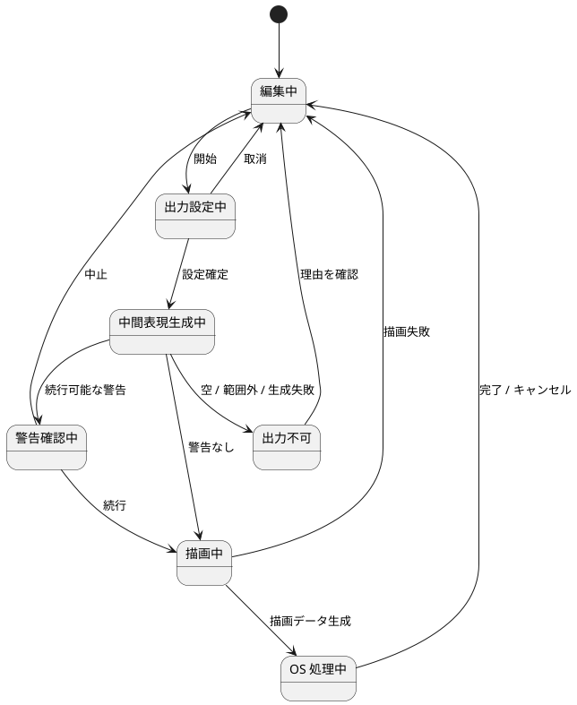
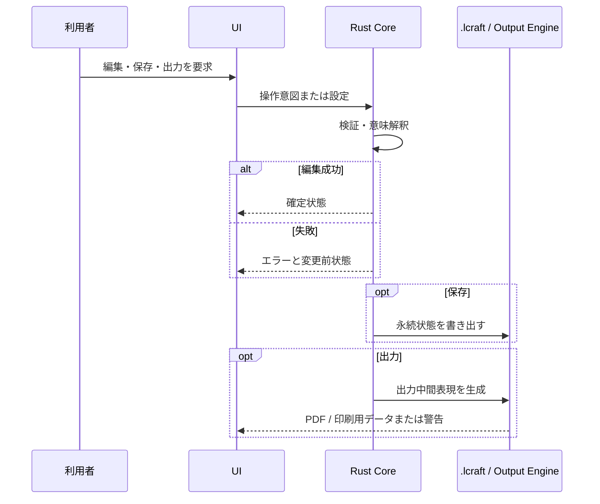

# KawaCAD 全体設計

## 1. 目的

本書は、機能別の設計文書を読む前に、KawaCAD 全体の構造と代表的な振る舞いを掴むための概略設計である。

次の3つの視点を分けて示す。

- **静的構造** — どの構成要素があり、何を所有・参照するか
- **動的構造** — ユーザー操作に対して、構成要素がどの順で協調するか
- **状態遷移** — 確定前、検証中、確定後、失敗時がどう移り変わるか

個別 API、型定義、アルゴリズム、画面レイアウトは扱わない。詳細な判断は各機能領域の設計文書、境界契約は `docs/design/internal-interface-spec.md`、保存形式は `docs/spec/file-format-spec.md` を正とする。

## 2. 設計の要点

| 観点     | 全体方針                                                                      |
| -------- | ----------------------------------------------------------------------------- |
| 正本     | 図形、拘束、パラメータ、パーツなどのドキュメント状態は Rust Core が所有する   |
| UI       | 表示、入力解釈、確定前の操作、OS 連携を担当する                               |
| 境界     | UI は操作の意図をコマンドとして送り、Core は確定済み状態またはエラーを返す    |
| 変更     | 1回のユーザー操作を原子的に適用し、失敗時は状態と履歴を変えない               |
| 保存     | 再現に必要なドキュメント状態だけを `.lcraft` に保存する                       |
| 出力     | Core がページ配置を確定し、共通の Output Engine から PDF と直接印刷を生成する |
| 機能拡張 | CAD 図形を基盤とし、派生要素、型紙の意味情報、パーツを上に重ねる              |

## 3. 静的構造

### 3.1 実行時コンポーネント

次の図は、アプリ実行中の主要な構成要素と責務境界を示す。

図の `kawacad-core` は両アプリが利用する共通実装を表し、実行時に同じセッションを共有することを意味しない。Swift/macOS は `kawacad-core-process` を別プロセスとして起動する。Tauri/React は別プロセスを起動せず、Tauri backend が同じアプリプロセス内で `kawacad-core` を呼び出す。両経路で要求・応答データの意味契約を共有する。

| 境界 | UI 側が決めること | 境界の先が決めること |
| --- | --- | --- |
| UI ↔ Core | 操作意図、表示方法、確定前状態 | 操作の成立可否、確定済み状態、履歴 |
| Swift adapter ↔ Core process | プロセスのライフサイクル、要求送信、応答受信 | JSON メッセージの解釈と Core 呼び出し |
| React UI ↔ Tauri backend | invoke の開始と応答の表示 | セッション保持、Core 呼び出し、OS 連携 |
| Core ↔ `.lcraft` | 保存・読み込みの意味 | JSON の検証可能な形状は Schema |
| Core ↔ Output Engine | 出力対象、ページ、位置、警告 | PDF / 印刷用データへの描画 |
| UI ↔ OS adapter | アプリ上の導線と判断 | ダイアログ、ウィンドウ、端末内データなどの副作用 |

### 3.2 ドメイン概念

最初の図は、`ProjectDocument` が所有する概念と、そこから導出する実行時情報を示す。

`CAD 基盤` と `型紙の意味情報・パーツ` の主要な関連は次の通り。中央の関連名は関係の意味、各端の多重度は許容件数を表す。

多重度は、左端が1つの参照先から見た参照元の件数、右端が1つの参照元が保持できる参照先の件数を表す。図中の `GeometryElement` は保存オブジェクトではなく、`Entity` と `DerivedElement` に共通する関連端をまとめるための概念上の抽象である。

- `DerivedElement.sourceIds` は `Entity` または別の `DerivedElement` を1件以上参照する。`Fillet` では2件以上で、派生要素間の循環参照は禁止する。
- `StitchStartPoint.targetId` は `Entity` または `DerivedElement` のどちらか1件を参照する。
- `RoundHole` と `StitchStartPoint` のパーツ所属は参照先から導出し、`Part` 自体にはそれらの ID を保存しない。

関連端は `.lcraft` Schema、Rust の保存モデル、ドキュメント検証を照合している。特に次の非対称な多重度に注意する。

- `Part` は `Entity` を1件以上持つが、派生要素、自由テキスト、計測表示は0件でもよい。各要素は複数の `Part` に重複所属できないため、逆端は `0..1` となる。
- `Entity` と `DerivedElement` の `layerId`、`styleId` は任意であり、1要素から見た参照先は `0..1` となる。
- `Constraint.targets` と `MeasurementAnnotation.targets` は1件以上である。対象は通常図形またはその制御点であり、派生要素を直接参照しない。
- `DimensionConstraintAnnotation` は必ず1つの寸法拘束を参照し、同じ拘束に対する表示位置は最大1件である。
- `RoundHole` は必ず1つの円 `Entity` を参照する。現行モデルは同じ円を参照する丸穴用途の重複を禁止していないため、逆端は `0..*` とする。

この構造では、同じ座標や形状を用途別に重複保存しない。例えば、丸穴は円の座標を複製せず円図形を参照し、オフセット線は解決後の形状を正本にせず元図形と距離を参照する。

### 3.3 永続状態と一時状態

保存対象の境界は「再読み込み後にプロジェクトの意味を再現するために必要か」で決める。計算結果と UI の一時状態は保存しない。

## 4. 動的構造

### 4.1 編集コマンド

代表的な編集は、プレビューと確定を分け、Core での検証に成功した場合だけ履歴へ追加する。

`Core adapter` は共通の意味上の境界を表す。Swift/macOS では標準入出力で別プロセスへ要求し、Tauri/React では invoke を経由して同一プロセス内の Core を呼び出す。

### 4.2 保存と読み込み

ファイル選択と Core 呼び出しの具体的な接続方法は UI ごとに異なるが、保存対象、読み込み検証、成功・失敗時の状態保証は共通である。

### 4.3 PDF・直接印刷（Swift/macOS）

Tauri/React は Output Document Model による出力プレビューまでを提供し、PDF 生成と直接印刷は行わない。次のフローは Swift/macOS に適用する。

## 5. 状態遷移

ここで示す状態は、設計を理解するための概念状態であり、同名の enum や型を実装へ要求するものではない。

### 5.1 編集操作の状態遷移

不変条件は、`操作中` と `Core 検証中` では永続状態と履歴を確定変更せず、`変更確定` に到達した操作だけを Undo 単位にすることである。

### 5.2 出力ユースケースの状態遷移

出力のどの状態でも、編集中の `ProjectDocument` と Undo/Redo 履歴は変更しない。

## 6. 横断する不変条件

| 不変条件                                 | 守る理由                                     |
| ---------------------------------------- | -------------------------------------------- |
| Core がドキュメントの正本を持つ          | UI と保存結果の食い違いを防ぐ                |
| 失敗した変更を部分反映しない             | 寸法・参照・履歴の整合性を保つ               |
| 参照は安定した ID で表す                 | 保存・複製・Undo/Redo 後も同じ関係を追跡する |
| 派生情報を正本と分ける                   | 元情報の変更後に一貫して再計算できる         |
| UI の一時状態を保存しない                | プロジェクトの意味と画面都合を分離する       |
| PDF と印刷で中間表現と描画規則を共有する | 実寸とレイアウトの差を防ぐ                   |
| 出力処理でドキュメントを変更しない       | 保存状態と履歴に副作用を残さない             |

## 7. 技術境界と UI 構成

KawaCAD は、OS 依存の UI / adapter と OS 非依存の Rust Core を分離する。Swift/macOS と Tauri/React は同じ Core の意味と保存形式を利用し、表示・一時操作・OS 連携だけをそれぞれの環境で担う。

| 領域 | 方針 |
| --- | --- |
| Swift/macOS | SwiftUI、AppKit、Core Graphics。macOS 13 以降の UI、ファイルダイアログ、PDF 保存、直接印刷を担当 |
| Tauri/React | Tauri、React、TypeScript。Windows・Linux・macOS の編集 UI と出力プレビューを担当し、PDF/直接印刷は含めない |
| Rust Core | 図形、拘束、派生要素、パラメータ、パーツ、履歴、保存、表示状態、出力中間表現を担当 |
| `kawacad-core-process` | macOS UI と Core の標準入出力 JSON 境界を担当 |
| Tauri adapter | React UI の invoke を受け、同じプロセス内の Core を直接呼び出す。UI から OS や Core の内部実装を直接参照させない |
| Output Engine | Core が確定した出力中間表現を PDF または印刷用描画データへ変換 |

両 UI は feature-first の責務分割を採用する。macOS は `Features/<Feature>/<Layer>`、Tauri/React は `features/<feature>/<layer>` を基本とし、entry point、adapter、共有語彙、UI 文言の責務を別に保つ。UI は選択、ドラッグ中の候補、viewport、パネル表示などの一時状態を所有し、ドキュメントの確定状態は Core が所有する。

## 8. 保存と主要フロー

`.lcraft` は再読み込み後にプロジェクトの意味を再現する永続状態だけを保存する。選択、ハイライト、ドラッグ中のプレビュー、ズーム、パン、パネル状態、自由度や派生形状の計算結果は必要時に再生成する。形式の外部契約は [`../spec/file-format-spec.md`](../spec/file-format-spec.md)、機械可読な形状は `schemas/lcraft/**` を正とする。

UI/Core の編集フローは、操作意図、必要に応じた preview、Core による検証、原子的な commit、状態再取得の順で進む。保存と出力は編集状態を変更せず、失敗時は現在のドキュメントと履歴を維持する。

## 9. 検証境界

Rust Core と Output Engine は OS 非依存の自動テストで、Swift/macOS と Tauri/React は UI、adapter、OS 連携、通常の境界で検証する。ここでの責務分担はテスト一覧を定義するものではなく、変更時に影響範囲を判断するための境界である。

## 10. 機能別設計への案内

| 全体図の要素                   | 詳細を読む文書                                                                              |
| ------------------------------ | ------------------------------------------------------------------------------------------- |
| CAD 基盤、コマンド、履歴、保存 | [CAD 基盤](cad-foundation/overview.md)                                                      |
| 自由度評価、連結成分、拘束状態 | [自由度評価](constraints/dof-algorithm.md)                                                  |
| オフセット、フィレット         | [オフセット線](derived-elements/offset-curves.md)、[フィレット](derived-elements/fillet.md) |
| 型紙の意味情報                 | [型紙要素の表現](pattern-elements/representation.md)                                        |
| パーツ                         | [パーツ管理](parts/overview.md)                                                             |
| 出力経路                       | [出力・印刷](output/overview.md)                                                            |
| 出力の静的構造                 | [出力中間表現](output/document-model.md)                                                    |
| A4 ページ分割                  | [A4 タイル出力](a4-tile-output/overview.md)                                                 |
| UI 内部の責務                  | [UI アーキテクチャ](ui-architecture/overview.md)                                            |
| ツールごとの選択               | [選択対象](interaction/selection-targets.md)                                                |

## 11. 参照する正本

- [`../spec/functional-spec.md`](../spec/functional-spec.md)
- [`architecture.md`](architecture.md)
- [`internal-interface-spec.md`](internal-interface-spec.md)
- [`../spec/file-format-spec.md`](../spec/file-format-spec.md)
- [`../glossary.md`](../glossary.md)
