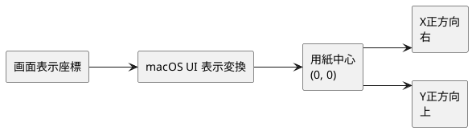
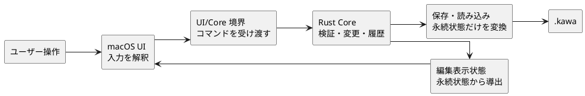
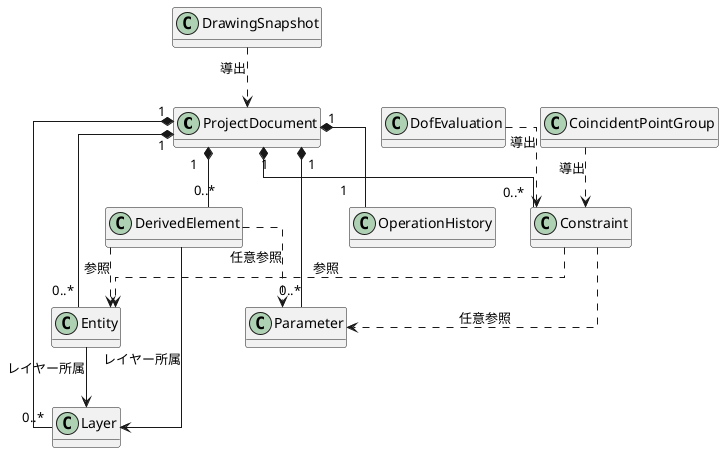
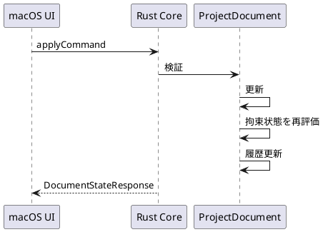
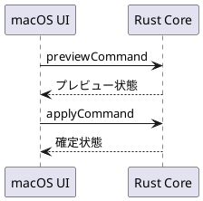

# CAD 基盤 概略設計

## 1. 目的

本書は、自由作図、拘束、パラメータ、履歴、保存・読み込みからなる CAD 基盤の全体像を整理する。

扱うのは、責務分担、永続化するデータ、境界で返す状態、主要な状態遷移である。個別API、詳細な型定義、アルゴリズム手順、UIの見た目は扱わない。

### 1.1 先に押さえる要点

| 観点 | 方針 |
| --- | --- |
| 正本 | 図形、拘束、パラメータなどのドキュメント状態は Core が持つ |
| UI | 入力と一時的な操作状態を扱い、ドキュメントの正本を複製しない |
| 変更 | 1回のユーザー操作を1つのコマンドとして原子的に適用する |
| 失敗 | 変更前の状態と Undo/Redo 履歴を維持する |
| 表示 | 永続状態から描画用状態を導出して UI へ返す |
| 保存 | 再現に必要な状態だけを `.kawa` に保存し、一時的な UI 状態は保存しない |

つまり、**UI が変更の意図を送り、Core が成立可否を判断し、成立した結果だけを表示・履歴・保存へ反映する**構成である。

## 2. 位置づけ

CAD 基盤は、型紙要素、パーツ管理、出力の土台である。

| CAD 基盤で扱うもの | 他の設計領域へ委ねるもの |
| --- | --- |
| 点、線分、円、円弧、中心線 | PDF出力、直接印刷 |
| 図形の追加、更新、削除、移動 | 縫い線・菱目・丸穴などのレザークラフト上の意味付け |
| 派生要素としてのオフセット線とフィレット | パーツの外形・穴・所属管理 |
| 幾何拘束、寸法拘束、固定拘束、対称拘束 | パーツ間を直接参照する拘束 |
| 名前付きパラメータ | パーツ間拘束 |
| Undo/Redo | 自動配置、出力レイアウト |
| `.kawa` 保存・読み込み |  |
| レイヤーと描画用状態 |  |

## 3. 設計前提

- 操作はコマンド単位で扱い、1回のユーザー操作に対応する変更はまとめて適用する。
- UIの選択、ハイライト、ドラフト中の補助情報は永続ドキュメントへ入れない。
- 永続データと描画用状態を分ける。
- 1つの開いているドキュメントに対して1つの Core プロセスを対応させる。
- 変更に失敗した場合は、部分反映を残さず変更前の状態を維持する。
- 参照は安定したIDで表現し、保存・読み込み後も同じ対象を追跡できるようにする。
- 作図座標は、用紙中心を原点、X正方向を右、Y正方向を上とするミリメートル単位の直交座標とする。

## 4. 全体構成

| 領域 | 責務 |
| --- | --- |
| UI | 入力解釈、選択、ハイライト、ドラッグ中状態、キャンバス描画、ファイル操作の起点 |
| 境界 | UI要求のコマンド化、Coreプロセス管理、現在状態とエラーの受け渡し |
| Core | 図形、拘束、パラメータ、履歴、保存・読み込み、描画用状態生成 |

境界をまたぐのは「操作の意図」と「Core が確定した結果」である。選択色やドラッグ途中の候補位置のような UI 専用情報は、ドキュメントの正本として Core へ保存しない。

作図完了時は、UI が完成済み図形を組み立てるのではなく、クリック点、
スナップ対象、水平・垂直補正、円弧の掃引方向などの入力意図を Core へ渡す。
Core は正規図形と付随する一致・方向拘束を一つの原子的な変更として生成する。

Core は編集表示用スナップショットと合わせて、注記や拘束マーカー、
縫い始め点の意味上のアンカー、線、角度弧、および表示可否を
mm 座標系の解決済み Canvas 投影として返す。UI はこの投影を画面座標へ変換し、
文字サイズ、ラベルオフセット、重なり回避、描画だけを行う。

## 5. 概念モデル

| 概念 | 役割 | 保存対象 |
| --- | --- | --- |
| ProjectDocument | 1つのプロジェクトの中心状態 | あり |
| Layer | 表示可否、印刷対象可否、線色、線幅、線種 | あり |
| Entity | 点、線分、円、円弧、中心線 | あり |
| DerivedElement | 元図形に追従するオフセット線、フィレット | あり |
| Constraint | 図形間の関係、寸法、固定、対称 | あり |
| Parameter | 寸法拘束から参照する名前付き値 | あり |
| OperationHistory | Undo/Redo 用の実行時履歴 | なし |
| DrawingSnapshot | 画面描画用の派生状態 | なし |
| DofEvaluation | 拘束状態と自由度の評価結果 | なし |
| CoincidentPointGroup | 一致拘束から導く論理点グループ | なし |

## 6. 主要フロー

### 6.1 通常更新

- 失敗時は状態を更新せず、エラーコードと補助情報を返す。
- 拘束追加や寸法変更では、対象だけでなく拘束で接続された図形集合を再整合する。
- 選択順は拘束成立可否を決める条件ではなく、アンカーが不足する場合の補助情報に留める。

### 6.2 非破壊プレビュー

- ドラッグ中は `previewCommand` で候補状態を得る。
- プレビューは保存対象、正式状態、Undo/Redo 履歴を変更しない。
- 確定時だけ `applyCommand` で履歴対象の変更にする。

### 6.3 保存・読み込み

- 保存対象は、メタ情報、レイヤー、図形、派生要素、拘束、パラメータ、保存形式バージョンである。
- Undo/Redo 履歴、選択状態、ハイライト、プレビュー状態は保存しない。
- 読み込みでは、保存時と同じ参照関係を復元する。
- 保存形式の詳細は `docs/spec/file-format-spec.md` に委ねる。

## 7. 判断事項

| 判断 | 方針 |
| --- | --- |
| 失敗時の扱い | 部分反映を残さない |
| UI状態 | 永続状態から分離する |
| 作図対象 | 点、線分、円、円弧を優先する |
| 派生要素 | オフセット線とフィレットを、通常図形へ固定しないCAD基盤の要素として扱う |
| 自由度評価 | 詳細は `docs/design/constraints/dof-algorithm.md` に分離する |
| DoF の分類規則 | `docs/design/constraints/dof-algorithm.md` に定義する |
| レイヤー | 表示と線スタイルの整理単位として扱う |

## 8. 既知の制限事項

- レイヤー運用は、表示可否、印刷対象可否、線スタイル変更に留める。
- オフセット線とフィレットの参照元として閉じた連続列を扱い、閉領域やパーツとしての意味付けはパーツ管理へ分離する。
- 自由曲線や複雑な面処理は対象外とする。

## 9. 参照

- `docs/README.md`
- `docs/design/architecture.md`
- `docs/design/internal-interface-spec.md`
- `docs/spec/file-format-spec.md`
- `docs/design/derived-elements/offset-curves.md`
- `docs/design/derived-elements/fillet.md`
- `docs/design/constraints/dof-algorithm.md`
- `docs/design/constraints/dof-algorithm.md`
