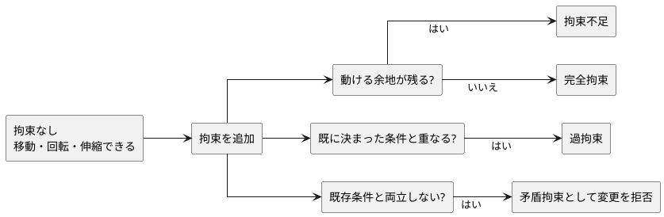
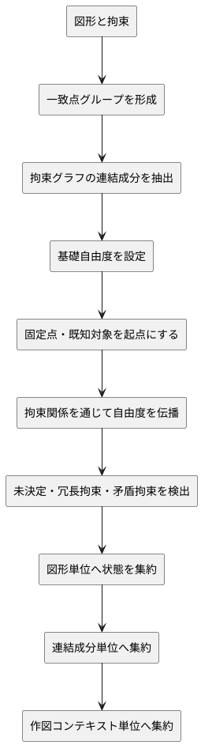
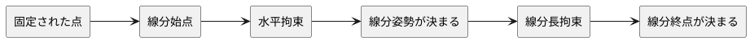
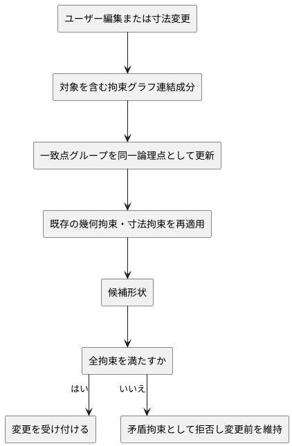

# 自由度評価アルゴリズム概説

## 1. 文書の目的

本書は、現行実装で採用する自由度評価アルゴリズムの考え方を整理する。

ここで扱うのは、図形と拘束からどのように自由度を評価し、エンティティ単位の拘束状態へ分類するかというアルゴリズム上の説明である。実装上の型、関数、モジュール構成、データ構造の詳細は扱わない。

### 1.1 30秒で掴む考え方

自由度とは「その図形がまだどのように動けるか」である。拘束を追加すると、移動・回転・伸縮などの余地が減る。

重要なのは、線分1本だけでなく、拘束でつながった図形のまとまり全体を見ることである。例えば、長方形の一辺は単独では動けそうでも、四辺が接続され、基準点・向き・幅・高さが決まれば、まとまりとして完全拘束になる。

## 2. 基本方針

自由度評価は、拘束そのものではなく、拘束を受けるエンティティの状態を判定するために行う。

現行実装では、PDOF（Propagation of Degrees of Freedom）の考え方を採用する。これは、固定点や既に自由度が確定した要素を起点に、拘束関係を通じて「どの自由度が残り、どの自由度が失われたか」を伝播させる考え方である。

本アルゴリズムの目的は、厳密な数式ソルバそのものではなく、ユーザーが作図中に理解できる拘束状態を安定して提示することである。

## 3. 評価の単位

### 3.1 エンティティ

自由度評価の主な表示単位はエンティティである。

| エンティティ | 主に見る自由度 |
| --- | --- |
| 点 | 平面上の位置 |
| 線分 | 位置、姿勢、長さ |
| 円 | 中心位置、半径 |
| 円弧 | 中心位置、半径、姿勢、端点位置 |
| 中心線 | 位置、姿勢 |

### 3.2 制御点と参照対象

拘束は、エンティティ全体ではなく、制御点や線分などの参照対象に作用することがある。

例えば、線分全体への水平拘束は線分の姿勢に作用し、線分端点への一致拘束は端点位置に作用する。評価では、これらの対象ごとの自由度変化をエンティティ単位へ集約する。

### 3.3 一致点グループ

一致拘束で結ばれた点や制御点は、一致点グループとして扱う。

一致点グループは、複数の点を同じ座標に置く論理的な点である。自由度評価では、グループに属する点を別々に動かせる対象として数えず、グループ全体の位置自由度として扱う。

### 3.4 拘束グラフの連結成分

拘束で接続されたエンティティ、一致点グループ、寸法条件は、1つの拘束グラフを構成する。

拘束追加、寸法値変更、パラメータ変更では、変更対象だけでなく、影響を受ける連結成分全体を評価する。これにより、個別の線分だけを見ると拘束不足に見える場合でも、4線分で作った長方形状のような図形集合全体として完全拘束になっている状態を判定できる。

## 4. 自由度の考え方

自由度は、対象がまだ動ける余地を表す。

| 対象 | 拘束なしの状態 | 例 |
| --- | --- | --- |
| 点 | 位置が未確定 | 任意の場所へ移動できる |
| 線分 | 位置、姿勢、長さが未確定 | 平行移動、回転、伸縮ができる |
| 円 | 中心位置、半径が未確定 | 中心移動、拡大縮小ができる |
| 円弧 | 中心位置、半径、姿勢、端点位置が未確定 | 移動、回転、半径変更、端点変更ができる |

拘束は、この自由度の一部または全部を減らす。

## 5. 評価の流れ

評価は概念的に次の順で行う。

1. 一致拘束から一致点グループを形成する。
2. 拘束で接続された連結成分を抽出する。
3. 各エンティティと一致点グループに、拘束なしの場合の基礎自由度を割り当てる。
4. 固定拘束、固定点、原点一致など、自由度を明確に消す対象を起点にする。
5. 一致、水平、垂直、距離、角度などの拘束を通じて、失われる自由度や駆動変更の影響を連結成分内の周辺対象へ伝播する。
6. 伝播後も自由度が残る対象を拘束不足として扱う。
7. 自由度を追加で減らさない拘束や、既に決まった状態を重ねる拘束を冗長または過拘束として扱う。
8. 既存の自由度評価と両立しない拘束追加または寸法変更は、矛盾として拒否する。

## 6. 拘束種別ごとの作用

| 拘束 | 主な作用 |
| --- | --- |
| 固定 | 対象点または対象要素の位置自由度をなくす |
| 一致 | 複数の点または制御点を同じ位置の一致点グループとして扱う |
| 水平 | 線分または2点間の姿勢を水平に制限する |
| 垂直 | 線分または2点間の姿勢を垂直に制限する |
| 平行 | 2つの線分の相対姿勢を同じにする |
| 直交 | 2つの線分の相対姿勢を直角にする |
| 対称 | 2つの点または制御点を中心線に対して対称にする |
| 直線上 | 点または制御点を線分または中心線の支持直線上に置く |
| 線分長 | 線分の長さを固定する |
| 2点間距離 | 2つの点または制御点の距離を固定する |
| 点と線分の距離 | 点から線分を含む直線への垂直距離を固定する |
| 線分間距離 | 2つの線分または中心線の支持直線間の垂直距離と平行性を固定する |
| 角度 | 2つの線分の相対角度を固定する |
| 直径 | 円の半径自由度を直径値から固定する |
| 半径 | 円または円弧の半径自由度を固定する |
| 線分長一致 | 複数線分の長さ自由度を連動させる |

## 7. 伝播の考え方

PDOF では、自由度が決まった対象から周辺へ拘束の影響を広げる。

例えば、線分に対して以下の拘束がある場合を考える。

- 始点が固定されている
- 線分が水平である
- 線分長が決まっている

この場合、始点位置、姿勢、長さが決まるため、終点位置も決まる。結果として、その線分は完全拘束として扱える。

一方、始点固定と線分長だけでは、線分は始点を中心に回転できる。そのため拘束不足として扱う。

### 7.1 一致拘束の伝播

一致拘束は、選択順に依存する移動命令ではない。

2つ以上の点が一致拘束で結ばれた場合、評価ではそれらを1つの一致点グループにまとめる。グループ内の点は同じ座標を共有し、グループにつながる線分、円、円弧へ自由度の変化を伝播する。

未拘束の線分端点と、水平拘束だけを持つ線分端点を一致させる場合、水平拘束を持つ線分はまだ平行移動できる。したがって、連結成分全体として解があるなら、一致拘束は矛盾ではなく成立する。

拘束追加時の形状更新では、新しい拘束を含む連結成分全体を対象にする。追加対象だけを動かすのではなく、固定拘束、原点一致、既存の固定対象などをアンカーとして残し、自由度を持つ点や図形を動かして拘束集合を満たす。選択順は、アンカーが不足するときのタイブレークであり、拘束の成立可否を決める主条件ではない。

アンカーは、次の優先順で選ぶ。

| 優先順 | アンカー候補 | アルゴリズム上の意味 |
| --- | --- | --- |
| 1 | 明示指定されたアンカー | 外部から明示された固定基準 |
| 2 | 固定拘束を持つ対象 | 自由度が明示的に消されている対象 |
| 3 | 原点または基準点への一致対象 | 作図座標系に対する基準対象 |
| 4 | 既存拘束で既に決まっている対象 | 既存拘束集合により位置、姿勢、寸法が決まっている対象 |
| 5 | 寸法値変更前の基準対象 | 駆動変更の前後で残すべき基準対象 |
| 6 | ユーザーが先に選択した対象 | 同等候補間のタイブレーク |
| 7 | 拘束 target の先頭 | 最後の安定したタイブレーク |

優先順が高いアンカー候補が複数ある場合は、既存形状からの変化が小さい解を選ぶ。同じ優先度で差がない場合は、対象IDや target 順などの安定した順序で決める。

### 7.2 駆動寸法変更の伝播

寸法拘束の値変更やパラメータ変更は、現在形状を単に検証する操作ではなく、拘束集合を満たす新しい形状を求める駆動変更である。

完全拘束された4線分の長方形状で長辺または短辺の寸法を変更した場合でも、固定点や水平・垂直・一致拘束を満たす別の解が存在するなら、連結成分全体を更新する。固定点同士の距離や矛盾する寸法などにより新しい解が存在しない場合だけ、変更を矛盾として拒否する。

駆動寸法変更の対象は、長方形状だけに限定しない。線分、円弧、円、点が拘束で接続された連結成分であれば、変更対象の寸法拘束を満たすために、同じ連結成分内の他の点や図形も更新対象になり得る。

点と線分の距離拘束では、対象点から線分を含む直線への垂直距離を評価する。距離は符号なしで扱い、線分のどちら側に点を残すかは現在形状とアンカー規則に従う。これにより、穴中心を辺から一定距離に保つような寸法変更でも、既存拘束を満たす解がある場合は連結成分全体を更新できる。

### 7.3 拘束不足な連結成分の編集伝播

拘束不足な連結成分は、自由度が残っているため編集できる余地を持つ。したがって、対象エンティティ単体を変更すると一時的に既存拘束が壊れる場合でも、連結成分全体として既存拘束を満たす解があるなら、操作は矛盾ではなく成立する。

例えば、連結線分集合の一部の線分を平行移動した場合、その線分の端点だけでなく、一致拘束で接続された隣接線分の端点も同じ論理点として更新する。水平・垂直・平行・直交・寸法などの拘束を持つ隣接要素は、それらの拘束を保つ範囲で連動する。

拘束不足な連結成分の編集では、以下を基本規則とする。

- 変更対象だけを検証して拒否するのではなく、対象を含む連結成分全体で解を探す
- 一致点グループは、グループ内の各制御点が同じ座標を共有する論理点として扱う
- 固定拘束や原点一致などの明確な基準がある場合は、その基準を優先して残す
- 明確な基準がない場合は、既存形状からの変化が小さくなる解を優先する
- 連結成分全体で既存拘束を満たす解がない場合だけ、矛盾として拒否する
- 矩形など特定図形だけを特別扱いせず、同じ拘束関係を持つ連結成分には同じ規則を適用する

## 8. 状態分類

| 状態 | 利用者から見た意味 | 判定の考え方 |
| --- | --- | --- |
| 拘束不足 | まだ図形を動かしたり寸法を変えたりできる | 評価後も対象に自由度が残っている |
| 完全拘束 | 基準に対して位置と形が決まっている | 位置、姿勢、寸法の自由度が残っていない |
| 過拘束 | 同じ意味の条件が重なっている | 既に決まっている自由度へ、同じ意味の拘束や冗長な拘束が追加されている |
| 矛盾 | 要求した変更を既存条件と同時に満たせない | 既に決まっている状態と両立しない拘束または寸法変更である |

矛盾は、保存済みの拘束状態ではなく、追加または変更を拒否するための検証結果として扱う。

## 9. 集約規則

エンティティ単位の状態は、作図コンテキスト単位の状態へ集約できる。

集約では、エンティティ単位の状態だけでなく、一致点グループと拘束グラフの連結成分の状態も参照する。

集約では、ユーザーが優先的に対応すべき状態を先に出す。

1. 矛盾する変更要求がある場合は、変更を拒否し、現在状態は維持する。
2. いずれかの対象が過拘束なら、集約状態は過拘束を示す。
3. 過拘束がなく、いずれかの対象が拘束不足なら、集約状態は拘束不足を示す。
4. すべての評価対象が完全拘束なら、集約状態は完全拘束を示す。

## 10. 代表例

### 10.1 線分が完全拘束になる例

| 条件 | 自由度への作用 |
| --- | --- |
| 始点固定 | 位置を決める |
| 水平 | 姿勢を決める |
| 線分長 | 長さを決める |

結果として、線分は完全拘束になる。

### 10.2 線分が拘束不足のまま残る例

| 条件 | 残る自由度 |
| --- | --- |
| 始点固定 + 線分長 | 回転できる |
| 水平 + 線分長 | 平行移動できる |
| 始点固定 + 水平 | 長さを変えられる |

### 10.3 円が完全拘束になる例

| 条件 | 自由度への作用 |
| --- | --- |
| 中心固定 | 中心位置を決める |
| 半径または直径 | 大きさを決める |

結果として、円は完全拘束になる。

### 10.4 円弧が拘束不足のまま残る例

中心固定と半径だけでは、円弧の姿勢や端点位置がまだ決まらない。そのため拘束不足として扱う。

### 10.5 4線分で作った長方形状が完全拘束になる例

4つの線分で長方形状を作り、4つの角を一致点グループとして接続する。向かい合う辺に水平拘束と垂直拘束を置き、1つの角を固定し、長辺と短辺に寸法拘束を置く。

この場合、連結成分全体の位置、姿勢、幅、高さが決まるため、拘束グラフの連結成分として完全拘束になる。長辺または短辺の寸法値を変更した場合は、固定された角を基準に新しい長方形状へ更新できる。

### 10.6 拘束不足な5線分の連結線分集合を編集できる例

5つの線分を隣接端点の一致拘束で接続する。下辺と上辺に水平拘束、左右どちらかの辺に垂直拘束があり、固定拘束や寸法拘束はないものとする。

この場合、連結成分全体にはまだ位置や寸法の自由度が残る。したがって、1本の水平線分を上下に平行移動したり、1本の垂直線分へ新しい長さ寸法を与えたりする操作は、連結成分全体として既存拘束を満たす解があるなら成立する。斜辺を含むなど、4線分長方形状ではない連結線分集合でも同じ考え方を適用する。

## 11. 制限事項

現行の自由度評価では、以下を厳密な対象にしない。

- すべての拘束式を連立方程式として完全に解くこと
- 浮動小数点誤差を含む微小な冗長性をすべて分類すること
- 曲線、ベジェ、自由曲線を含む自由度評価
これらは、詳細設計時の追加検討事項として扱う。

## 12. 不変条件と失敗時の扱い

- 同じドキュメント状態と拘束集合からは、同じ自由度分類を得る。
- 拘束の追加、更新、削除、参照先の変更では、評価できない状態を確定保存しない。
- 拘束不足、完全拘束、冗長拘束、競合は、連結成分と対象の意味を失わない分類として扱う。
- 評価に必要な参照が欠ける場合は操作を拒否し、変更前の状態と履歴を維持する。

## 13. 参照

- `docs/spec/functional-spec.md`
- `docs/design/cad-foundation/overview.md`
