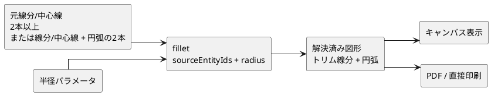
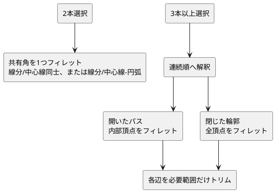
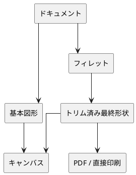
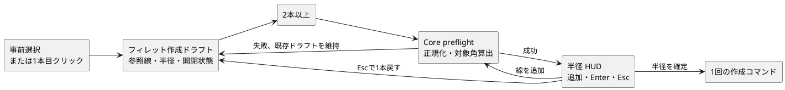

# フィレット派生要素 概略設計

## 1. 目的

フィレットは、CAD 基盤に属する派生要素として扱う。接続する図形の角を指定半径の円弧で丸め、作成時点の通常図形へ固定せず、元図形または半径パラメータの変更に追従する。

## 2. 対象範囲

線分または中心線で構成された接続パスを対象に、トリム済み線分とフィレット円弧を解決済み図形として生成する。2本だけを指定した場合は、その2本がなす1つの角を対象にする。3本以上の開いた連続パスでは内部頂点を対象にし、閉じた輪郭では全頂点を対象にする。半径は固定ミリメートル値または名前付きパラメータ参照を扱う。

接続する線分または中心線と円弧の2要素も、単一の角として対象にする。選択順にかかわらず、線分側と円弧側を必要な範囲だけトリムし、その間を接線接続するフィレット円弧を生成する。円弧を含む3要素以上のパス、閉じた輪郭、および円弧同士の組み合わせは対象外とする。

## 3. 表示と出力

キャンバス表示では、編集時に元図形を確認できるよう、元図形と解決済みフィレット図形の両方を表示対象に含める。元図形は最終形状より薄い線として表示する。

PDF 出力および印刷用中間表現では、フィレットの参照元となった通常図形を除外し、フィレット適用後のトリム済み図形だけを出力対象にする。

## 4. 失敗時の扱い

Core は、半径が大きすぎる、参照元が接続していない、参照元が未対応図形である、または循環参照になる場合にコマンドを拒否する。線分または中心線と円弧の組では、2要素の開いたパスでなく、両方のトリム範囲と接線接続を成立させられない場合も同様に拒否する。成功済みの派生要素が元図形変更によって再解決できなくなった場合は、対象派生要素を削除し警告を返す。

複数選択による作成では、Core の事前検証が選択順やID順ではなく端点接続から参照元列を決定する。開いたパスは両端の向きを含めて、閉じた輪郭は開始位置と巡回方向を含めて決定的な列へ正規化する。UI はこの列と開閉判定をそのまま確定コマンドへ渡すため、同じ参照集合を事前検証だけ通過して確定時に拒否する状態を作らない。

## 5. 作成ドラフト

フィレットツールの事前選択と逐次クリックは、UI の単一の作成ドラフトへ収束させる。ドラフトは Core の事前検証結果（正規化済み参照順、開閉状態）と未確定の半径入力を保持する一時状態であり、作成成功時だけ1つの派生要素コマンドへ変換される。

| ドラフト段階 | 表示上の扱い |
| --- | --- |
| 1本 | 参照線だけを保持し、接続線の追加を案内する。半径 HUD は表示しない。 |
| 2本以上 | Core 事前検証後の参照線数、対象角数、開いたパス／閉輪郭を HUD に表示する。半径入力後も参照線を追加できる。 |
| 失敗 | 直前までの有効なドラフトと半径を保持し、失敗理由だけを表示する。 |

## 6. 検証観点

| 観点 | 確認内容 |
| --- | --- |
| 幾何計算 | 接続線分からトリム線分と円弧が生成され、線分/中心線-円弧では両方へ接線接続する |
| 連続パス | 開いた連続パスと閉じた線分輪郭で、対象頂点がまとめてフィレットされる |
| 順序正規化 | 同じ参照集合を異なる選択順で渡しても、同じ参照元列と開閉判定になる |
| パラメータ | 半径パラメータ変更に、線分/中心線-円弧を含めて追従する |
| 保存・読み込み | `fillet` payload が `.lcraft` で再現される |
| 出力 | 元線分を除外し、最終形状だけを出力する |
| 失敗 | 円弧を含む未対応の経路や、半径・接線が不成立の組で状態を壊さない |
| 作成ドラフト | 事前選択と逐次クリックが同じ参照集合・半径入力・取消規則へ収束する |
