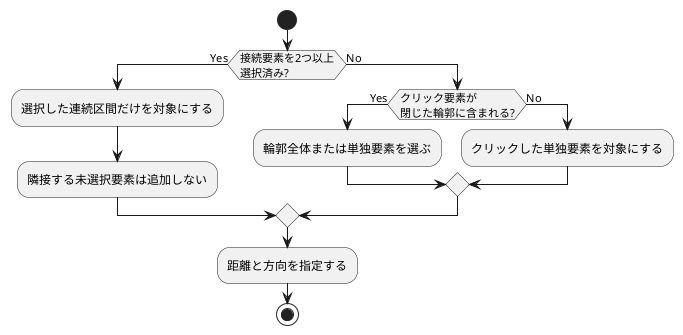
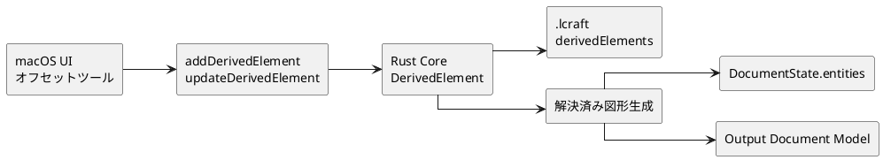
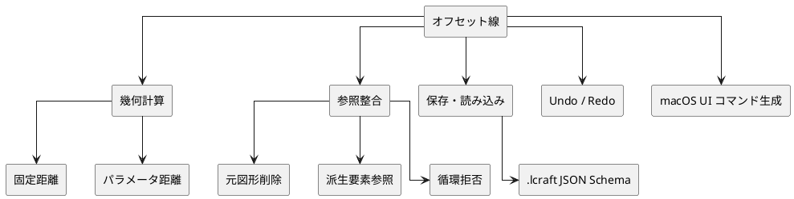

# オフセット線 概略設計

## 1. 目的

オフセット線は、CAD 基盤に属する派生要素として扱う。外形線や基準線から一定距離にある線を、作成時点の通常図形へ固定せず、元図形と距離指定を保存し、表示・出力時に解決済み図形として生成する。

## 2. 対象範囲

対象:

- 線分、中心線、円、円弧を元にしたオフセット線
- 複数の連続した元図形を参照するオフセット線
- 接続した外形から選択した連続区間だけを参照するオフセット線
- 派生要素を参照元にしたオフセット線
- 固定ミリメートル値または名前付きパラメータ参照による距離指定
- 表示、選択、Undo/Redo、保存・読み込み、出力での再現
- 作成後の距離・方向・レイヤー変更と削除

対象外:

- オフセット線を拘束の target にすること
- 菱目や丸穴そのものをオフセット元にすること
- 縫い線や菱目配置など、レザークラフト上の意味付け

## 3. オフセット元の範囲

2つ以上の元図形を明示的に選択した場合は、その選択を利用者が指定した区間として扱う。端点で接続する選択要素だけをオフセット元にし、隣接する未選択要素へ範囲を自動拡張しない。これにより、閉じた外形の一部だけに縫い線用のオフセット線を作成できる。

フィレットの元線分を部分選択した状態でフィレット適用後の形状をクリックした場合は、フィレット本体を参照元としながら、選択線分に対応するトリム済み線分と、その間のフィレット円弧を解決済み形状内の連続区間として保持する。これにより、フィレット形状を失わず、未選択部分へ範囲を広げずに追従できる。

複数選択がない状態で閉じた輪郭の構成要素をクリックした場合は、輪郭全体と単独要素を候補にする。一部の連続区間だけにオフセット線を作成する場合は、先に必要な区間を複数選択する。

## 4. データの流れ

## 5. 責務

| 領域 | 責務 |
| --- | --- |
| UI | 元図形と連続区間の選択、クリック側に基づく方向初期値、距離入力、パラメータ参照切り替え、派生要素編集コマンド発行 |
| Core | 選択区間の連続性と参照の検証、循環参照拒否、距離解決、オフセット形状生成、元図形削除時の派生要素削除と警告 |
| 保存形式 | 派生要素 ID、参照元図形、必要に応じて派生元の解決済み形状内の連続区間、距離、方向を保存 |
| 出力 | 解決済みオフセット図形を通常図形と同じ出力規則で扱う |

## 6. 検証観点

主な検証:

- 固定距離とパラメータ距離で解決済み図形が生成されること
- 選択した連続区間だけがオフセット元になり、隣接する未選択要素へ範囲が拡張されないこと
- フィレットの部分選択では、選択線分に対応するトリム済み線分と円弧だけが保存・再生成されること
- 開いた連続区間に含まれるフィレット円弧が進行方向に応じた側へオフセットされ、隣接線分との接線接続を維持すること
- 接続していない複数要素をオフセット元にできないこと
- パラメータ変更後にオフセット線が追従すること
- 保存・読み込み後に派生要素が再現されること
- 元図形削除時に参照切れが残らないこと
- 派生要素を参照元にでき、循環参照は拒否されること
- UI が `addDerivedElement` / `updateDerivedElement` / `deleteDerivedElement` コマンドを生成できること
