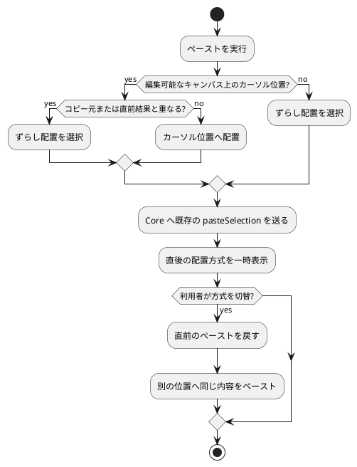

# ペースト配置の判断

## 目的

コピーした型紙要素を、利用者が作業しているキャンバス上の位置へ予測可能に配置する。コピー依存閉包と保存形式は変更せず、Core は不透明なクリップボード内容に加えて選択範囲の外接矩形を返す。

## 配置の流れ

## 責務と失敗境界

| 領域 | 責務 |
| --- | --- |
| UI | カーソル文脈、ずらし量、一時的なペーストオプション、結果の説明を管理する。 |
| Core | 選択範囲の外接矩形を返し、既存の選択スナップショットを検証して依存閉包を含む原子的なペーストを行う。 |

配置方式の切替は、直前のペーストを取り消してから同じ ID namespace で別位置へ貼り直す。途中で失敗した場合は元の結果を再適用し、余分な複製、ID、履歴を残さない。

## 検証の重点

- キャンバス内、キャンバス外、コピー元付近、同一位置での配置判断
- 連続ペーストの5 mmずつのずらし
- 方式切替後の要素数、依存関係、Undo/Redo、保存・読み込み
- `Command-V`、編集メニュー、コンテキストメニュー、およびVoiceOverから同じ操作へ到達できること
