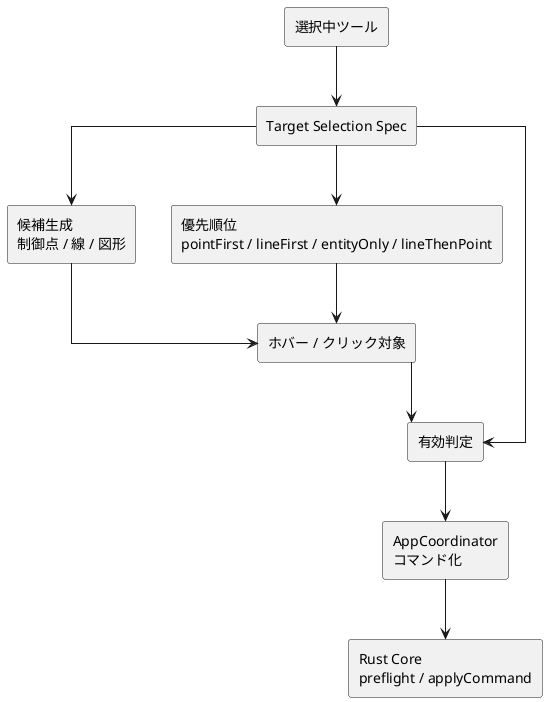
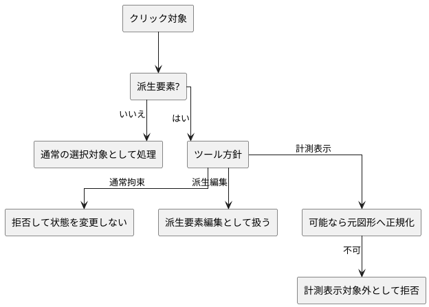
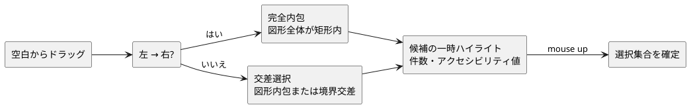

# 拘束・計測表示ツールの選択仕様単純化

## 目的

拘束・計測表示ツールでは、クリック位置から得た対象を Core の `ConstraintTarget` として送る。対象種別の解釈が UI 内で分散すると、ホバーでは有効に見えるが確定時に拒否される、または意図しない target 種別で送られる不具合が起きやすい。

この設計では、UI 側の選択規則を少数のパターンへ寄せ、候補生成、優先順位、有効判定で同じ方針を使う。

## 方針

| パターン        | 使いどころ                                               |
| --------------- | -------------------------------------------------------- |
| `pointFirst`    | 点や制御点を主対象にする拘束、端点距離表示               |
| `lineFirst`     | 線分を主対象にする拘束、線分長、2線分角度                |
| `entityOnly`    | 円、円弧などエンティティ本体を選ぶ計測表示や寸法         |
| `lineThenPoint` | 既存操作感として線を優先しつつ点も扱う距離系、オフセット |

## 派生要素の扱い

通常拘束では派生要素を target にしない。オフセット、フィレット、フィレット半径編集のような派生要素編集だけが例外として扱う。計測表示では永続参照として安全な元図形へ正規化できる場合に限って受け入れる。

## 矩形範囲選択

選択ツールで空白からドラッグした場合、開始点と現在点は UI の一時状態だけに保持する。ドラッグ方向から選択方式を決め、同じ候補集合を一時ハイライト・件数表示・マウスアップ時の確定に使う。したがって、範囲選択は Core、保存済みドキュメント、Undo/Redo を更新しない。

| 方式     | 方向  | 図形ごとの判定                                                         | フィードバック                         |
| -------- | ----- | ---------------------------------------------------------------------- | -------------------------------------- |
| 完全内包 | 左→右 | 点は矩形内、線分・中心線は両端、円・円弧は全体が矩形内                 | 青系・実線・`完全に含まれる図形を選択` |
| 交差選択 | 右→左 | 点は矩形内、線分・中心線は矩形と交差、円・円弧は実際の輪郭と矩形が交差 | 緑系・破線・`交差する図形を含めて選択` |

フィレットの解決済み表示プリミティブは、既存の通常選択規則どおり候補から除外する。オフセットなど選択可能な派生要素は、解決済み表示ごとではなく既存の論理選択 ID を1件として候補へ加える。

## 検証観点

- hover で有効な対象が click 後にも同じ target 種別として受理される。
- 点を必要とするツールは端点付近で制御点を選び、線を必要とするツールは線 target を選ぶ。
- 円弧角表示は円弧だけを対象にし、2線分角度表示は線分だけを対象にする。
- フィレット解決済み線分は、通常拘束では拒否され、計測表示では元線分へ正規化される。
- 左→右の完全内包と右→左の交差選択は、同じ矩形でも別の候補集合になり、ドラッグ方向を反転するとただちに候補と表示方式が変わる。
- 線分・中心線・円・円弧の選択判定は外接矩形だけで過剰選択しない。候補件数、確定集合、アクセシビリティ値は同じ候補集合を参照する。
