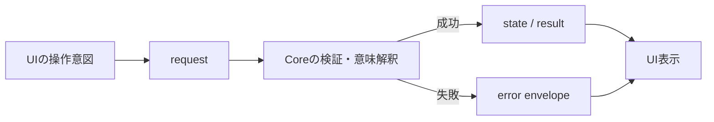
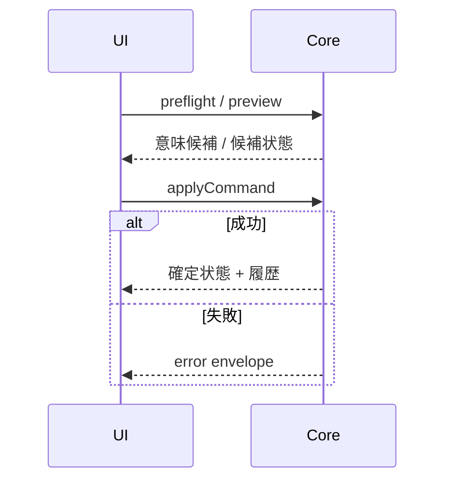

# UI とコアロジックのインターフェース仕様書

## 1. 目的と正本

本書は、Swift/macOS UI と Tauri/React UI が Rust Core と交わす境界について、責務、メッセージの意味、セッションの扱い、成功・失敗時の保証を定義する。UI 内部の状態管理、Core 内部のアルゴリズム、保存形式の詳細は扱わない。

境界仕様の正本は、内容によって次のように分かれる。

| 内容 | 正本 |
| --- | --- |
| 責務、操作の意味、原子性、失敗時挙動 | 本書 |
| interface 固有 JSON のうち Schema 化済みの形状 | `schemas/interface/0.1.0.schema.json` |
| `.kawa` と共通する保存オブジェクトの形状 | `schemas/kawa/0.1.0.schema.json` |
| Rust / Swift が同じ wire shape を扱うこと | 両側の契約テストと `tests/fixtures/interface/**` |

現行 interface schema は、preflight、共有スタイル、意味コマンド、選択転送、エラー、出力に使う境界オブジェクトを対象とする。Schema に未収録の既存メッセージは本書の一覧を契約とし、今後フィールドを追加・変更する場合は、長いフィールド表を本書へ増やすのではなく interface schema の対象を広げる。

## 2. 責務

### 2.1 UI

UI は利用者との接点と一時的な表示状態を扱う。

- 入力イベント、選択、ハイライト、ドラッグ中の候補
- キャンバス描画、パネル、ズーム、パン、表示補助
- ファイル選択、PDF 保存、Swift/macOS のプリンタ列挙と印刷ジョブ開始
- Core へ送る操作意図の組み立てと、応答の利用者向け表示

UI は応答性のためにヒットテスト候補を絞り込んでよい。ただし、閉輪郭、接続順、参照依存、計測値、正規化後の図形など、ドキュメントの意味となる結果を確定しない。

### 2.2 Core

Core はドキュメントの正本と意味を扱う。

- 図形、派生要素、型紙要素、拘束、パラメータ、レイヤー、共有スタイル、パーツの変更
- 参照整合性、閉輪郭、依存閉包、正規図形、計測値の解釈
- コマンドの検証、原子的適用、Undo/Redo
- `.kawa` の読み込みと書き出し
- 編集表示、出力プレビュー、出力用中間表現の生成

### 2.3 共通原則

- 永続状態の変更は `DocumentCommand` 単位で Core へ送る。
- Core は成功した変更だけを状態と履歴へ反映する。
- 失敗した変更は、直前のドキュメント状態と Undo/Redo 履歴を変えない。
- UI は Core の最後に確認できた状態を表示し、独自の永続状態を正本にしない。

Swift/macOS UI と Tauri/React UI は同じ意味契約を利用する。Swift/macOS は macOS 13 以降のファイル、PDF、印刷 adapter を持つ。Tauri/React は Windows・Linux・macOS の編集、出力プレビュー、PDF 保存を扱い、Windows と CUPS/IPP 対応 Linux では直接印刷 adapter を持つ。



## 3. セッションとトランスポート

Swift/macOS と Tauri/React は、Core へ渡す要求、Core から受け取る応答、エラー、原子性、Core の状態所有に関する意味契約を共有する。接続形態だけが異なり、Swift/macOS は `kawacad-core-process` を別プロセスとして起動する一方、Tauri/React は Tauri backend と同じプロセス内で `kawacad-core` を直接呼び出す。以下の 3.1 から 3.3 は Swift/macOS のプロセス接続について記述する。

### 3.1 プロセスの起動

Swift/macOS UI は1つの開いているドキュメントに1つの `kawacad-core-process` を対応させ、標準入力と標準出力で通信する。

| 操作 | 起動または入力 | 結果 |
| --- | --- | --- |
| バージョン取得 | `kawacad-core-process --version-json` | `fileFormatVersion` と `schemaVersion` を1行の JSON で返して終了する |
| 新規ドキュメント | `kawacad-core-process --new <name>` | 新規セッションを開始する |
| ファイルから開始 | `kawacad-core-process --read-kawa-file <path>` | 検証済み `.kawa` からセッションを開始する |
| JSON から置換 | 起動済みセッションへ `loadDocument` | 成功時に同じプロセスの現在ドキュメントを置き換える |
| 終了 | UI が標準入力を閉じる、またはプロセスを終了する | セッションと履歴を終了する |

診断ログは標準エラーへ出力し、標準出力には UI が解釈する JSON だけを出力する。

`loadDocument` で読み込む `.kawa` は Undo/Redo 履歴を含まない。置換に成功すると読み込み前の履歴も破棄され、読み込んだ状態から新しい履歴を開始する。読み込みに失敗した場合は現在ドキュメントと履歴を維持する。

### 3.2 要求と応答の対応

- UTF-8 の1行を1つの request / response とする。
- 1セッション内の呼び出しは直列化し、1件の応答を受け取ってから次の要求を処理する。
- 現行 envelope に request ID はなく、応答は直前の要求に対応する。
- 同一セッション内の並行実行、処理中 request のキャンセル、request 単位のタイムアウトは提供しない。
- 空行は Core が読み飛ばす。

標準出力の EOF、非 UTF-8 応答、解釈不能な応答、プロセス終了は transport 失敗として扱う。UI はセッションを利用不能として提示し、最後に確認できた表示状態を破棄しない。

変更 request の書き込み後に transport が失敗した場合、UI は適用の成否を確定できない。同じ変更を自動再送してはならず、利用者に接続失敗を示す。新しいセッションへ切り替える場合、保存済み `.kawa` または明示的に保持した JSON からドキュメントは復元できるが、終了したセッションの Undo/Redo 履歴は復元されない。

### 3.3 バージョン

`--version-json` は現行 Core の完全な `fileFormatVersion` と `schemaVersion` を返す。現行 macOS UI は応答を検証し、接続状態には各 major version を表示する。UI/Core の組は同じアプリケーションビルドに同梱されたものを前提とし、pipe envelope 自体には `protocolVersion` を持たない。

`.kawa` の読み込み可否は Core がファイル内の完全なバージョンで検証する。対応する組み合わせは `docs/spec/file-format-spec.md` を正とする。

### 3.4 UI ごとの transport

UI による transport の違いは接続方法に限り、request、response、エラー、原子性、Core の状態所有は共通である。

| UI | Core 接続 | OS 固有の境界 | 出力境界 |
| --- | --- | --- | --- |
| Swift/macOS | `kawacad-core-process` の標準入力/標準出力。1行1 JSON、1セッション1ドキュメント | Swift adapter がプロセス起動、ファイル選択、PDF 保存、macOS 印刷を担当 | Core の Output Document Model → Output Engine → Swift/macOS adapter |
| Tauri/React | React から Tauri の `invoke` adapter を経由し、Tauri backend と同じプロセス内で `kawacad-core` を直接呼び出す | Tauri adapter がダイアログ、ウィンドウ、ローカルデータ、PDF 保存を担当 | Core の Output Document Model を出力プレビューへ渡し、同じモデルを Output Engine で PDF 化する。直接印刷は提供しない |

Tauri/React は `kawacad-core-process` を起動せず、Tauri backend が Core のセッションを保持する。invoke 名や adapter 内部の transport は、この文書で定める Core の request/response 意味を変更しない。直接 Core 境界を使う場合も、React の feature が Core の内部型や永続状態を直接所有してはならない。

## 4. JSON 共通規則

request は次の envelope を持つ。現行 request はすべて object の `payload` を持ち、`null` は送らない。

```json
{
  "kind": "documentState",
  "payload": {
    "viewMode": "editDisplay"
  }
}
```

| 項目 | 規則 |
| --- | --- |
| プロパティ名 | 原則 camelCase |
| 例外 | `ConstraintTarget.controlPoint.entity_id` と出力 geometry / print command の一部は Schema に従い snake_case |
| 数値 | JSON number。座標と長さは mm、利用者が指定する角度寸法は度数法 |
| 座標系 | 用紙中心が原点、X 正方向が右、Y 正方向が上 |
| ID | 空文字ではない安定文字列。追加時は UI が生成してよい |
| `null` | Schema または対象オブジェクトで明示的に許可された箇所だけで使う |
| 未知フィールド | UI は送らない。受信側の許容可否は対象 Schema に従う |
| 配列順 | レイヤー、共有スタイル、パラメータなど、UI が一覧表示する配列は受信順を表示順として扱える |

## 5. request と response

### 5.1 request 一覧

| `kind` | 成功 response | 意味 |
| --- | --- | --- |
| `loadDocument` | `DocumentStateResponse` | `.kawa` JSON で現在セッションのドキュメントを置き換える |
| `documentState` | `DocumentStateResponse` | 指定表示モードの現在状態を取得する |
| `previewCommand` | `DocumentStateResponse` | コマンド適用後の候補状態を非破壊で試算する |
| `preflightConstraint` | `PreflightConstraintResponse` | 拘束対象を解釈し、成立可否と初期値候補を返す |
| `preflightDerivedElement` | `PreflightDerivedElementResponse` | 派生要素の元参照、閉輪郭、方向と候補を返す |
| `layerDeletionImpact` | `LayerDeletionImpactResponse` | レイヤー削除前に参照中の図形・派生要素件数を返す |
| `evaluateMeasurement` | `MeasurementEvaluation` | 計測表示の現在値と意味上の表示基準点を返す |
| `exportSelection` | `SelectionClipboardExport` | 選択対象を依存関係込みの不透明な転送データへする |
| `exportPartLibraryItem` | `PartLibraryExport` | パーツと依存内容をローカルライブラリ用の不透明な転送データへする |
| `applyCommand` | `DocumentStateResponse` | コマンドを原子的に適用する |
| `undo` | `DocumentStateResponse` | 直前の成功した変更を取り消す |
| `redo` | `DocumentStateResponse` | 取り消した変更を再適用する |
| `writeKawaFile` | `{ "written": true }` | 現在ドキュメントを指定パスへ書き出す |
| `buildOutputDocumentModel` | `BuildOutputDocumentModelResponse` | 出力用中間表現と警告を生成する |
| `renderPdf` | `RenderPdfResponse` | 出力用中間表現を PDF byte 列へ変換する |
| `renderPrint` | `PrintRenderData` | 出力用中間表現を Swift/macOS と Tauri/Windows の印刷用描画データへ変換する |

`loadDocument`、`previewCommand`、`applyCommand`、`undo`、`redo` の `viewMode` は省略時 `editDisplay` とする。`documentState` の `viewMode` は必須である。

`writeKawaFile` の `markClean` は省略時 `true` とする。通常保存は `true` を指定し、成功した内容をセッションの保存済み基準にする。クラッシュ復旧の一時スナップショットは `false` を指定し、dirty 状態を変えない。

`buildOutputDocumentModel` は、用紙向き、寸法拘束ラベルの有無、50mm ガイドの有無、固定の `0` 度回転、選択した OS adapter が取得した印刷可能領域を受け取る。用紙向きはツールバーの A4 基準表示で変更し、出力シートでは変更しない。`renderPdf` と `renderPrint` は、直前に生成した Output Document Model の JSON 文字列を受け取る。

### 5.2 `DocumentStateResponse`

状態 response は、UI がドキュメントを表示・操作するために必要な現在値をまとめて返す。

| 区分 | 内容 |
| --- | --- |
| 集約 | ドキュメント名、要素件数、編集表示と出力プレビューの集約拘束状態 |
| 履歴 | `canUndo`、`canRedo` |
| 永続状態 | 保存済み基準との差を表す `isDirty` と、内容比較用の不透明な `revision` |
| 変更結果 | 直前の変更で作成・更新・削除されたオブジェクト種別ごとの ID |
| 保存対象 | レイヤー、共有スタイル、パラメータ、パーツ、図形、派生要素、自由テキスト、丸穴、縫い始め点、拘束、計測表示、寸法拘束表示位置 |
| 評価結果 | パラメータ使用状況、エンティティ単位の拘束状態と残自由度、一致点グループ、計測値 |
| 通知 | 直前の成功した変更に伴う警告 |

`editDisplay` は元図形、派生要素、拘束と注釈を編集する表示を返す。`outputPreview` は印刷対象に近い解決済み形状を返し、フィレットで置換される元図形など出力時に抑制される要素を除く。どちらも UI 専用の選択、ズーム、パン、パネル状態は返さない。

状態には非永続の `canvasProjection` を含める。これは現在形状と表示モードから
Core が生成し、縫い始め点、計測表示、寸法拘束、拘束マーカーの解決済み
mm 座標と表示可否、および表示対象の自由テキスト ID を返す。寸法レイヤーの
表示・出力可否もここで反映するため、UI はレイヤー状態から注釈の可視性を再判定しない。

各描画エンティティには、Core が確定した派生要素 ID、解決 index、対応する元図形 ID、フィレットによる抑制状態を付与する。該当しない値は省略する。UI は描画 ID の命名規則や解決 index の並びからこれらを推測しない。

`mutation` は `applyCommand`、`undo`、`redo` の成功 response に含め、`created`、`updated`、`deleted` ごとに型付き ID 配列を返す。問い合わせと preview では省略する。UI は作成後の選択やフォーカスにこの結果を使い、request payload や Core の ID 命名規則を解析しない。

### 5.3 問い合わせ response

- 拘束 preflight は、正規化した target、現在形状から求めた初期値候補、成立しない場合の理由を返す。UI は独自の target 判定を最終結果にしない。
- 派生要素 preflight は、ヒット候補と選択候補から Core が解釈した元参照、対象範囲（`singleElement`、`selectedRange`、`closedContour`）、方向、作成または更新候補を返す。フィレット適用後の形状を部分選択した場合は、フィレット本体の参照に加え、その解決済み形状内で対象にする連続区間の参照を返す。
- 計測評価は現在形状から再計算した値であり、ドキュメントを変更しない。
- 選択 export の `clipboardJson` は Core 所有の不透明な文字列である。UI は内容を編集せず、paste request へ戻す。`anchorPoint` と `bounds` は選択依存閉包の表示上の外接矩形中心および外接矩形であり、UI は貼り付け位置の決定とコピー元との重なり回避だけに利用する。
- パーツライブラリ export の `libraryJson` は Core 所有の不透明な文字列である。UI は表示用のパーツ情報と一緒にローカル保存できるが、内容と内部 ID を解釈せず、配置コマンドへ戻す。

## 6. `DocumentCommand`

payload の機械可読な形状は、対象が保存オブジェクトなら kawa schema、interface 固有コマンドなら interface schema を優先する。本節は利用可能なコマンドと意味を一覧化する。

### 6.1 ドキュメント、図形、派生要素

| `kind` | 主な入力 | 意味 |
| --- | --- | --- |
| `renameDocument` | `name` | ドキュメント名を変更する |
| `addEntity` / `updateEntity` / `deleteEntity` | `Entity` または ID | 基本図形を追加、置換、削除する |
| `moveEntities` | entity IDs、移動量 | 選択図形を移動する |
| `moveControlPoint` | control point、移動先 | 制御点移動の意図から正規図形を更新する |
| `createEntityFromGesture` | 図形 ID、クリック点、補正意図、任意のスナップ対象 | 正規図形と付随拘束を原子的に作成する |
| `setEntityMetric` | entity ID、metric | 線分長、円半径、円弧半径・角度の意図から正規図形を更新する |
| `setEntityLayer` | entity ID、layer ID | 図形全体を再送せずレイヤー参照だけを変更する |
| `setDerivedDistance` / `setDerivedRadius` / `setDerivedRadiusFromPoint` / `setDerivedDirection` | derived element ID、値、ポインタ位置または方向 | 派生要素全体を置換せず意味値を変更する |
| `setDerivedLayer` / `setDerivedSharedStyle` / `setFilletSources` | derived element ID、変更値 | 派生要素の表示属性またはフィレット元参照だけを変更する |
| `smoothArcTangencies` | arc entity ID | 接続線分と円弧を再構成し、必要な接線拘束をまとめて適用する |
| `addDerivedElement` / `updateDerivedElement` / `deleteDerivedElement` | `DerivedElement` または ID | オフセットまたはフィレットを追加、置換、削除する |

### 6.2 型紙要素、レイヤー、スタイル

| `kind` | 主な入力 | 意味 |
| --- | --- | --- |
| `addFreeText` / `updateFreeText` / `deleteFreeText` | `FreeText` または ID | 自由テキストを追加、置換、削除する |
| `createRoundHole` | 丸穴 ID、円図形 ID、中心、直径、用途、任意のレイヤー／スタイル | Core が円図形と丸穴用途を原子的に作成する |
| `addRoundHole` / `updateRoundHole` / `deleteRoundHole` | `RoundHole` または ID | 既存円図形の丸穴用途を追加、置換、削除する |
| `setRoundHoleDiameter` | round hole ID、直径 | 参照円を再構築せず丸穴径を変更する |
| `setRoundHoleKind` | round hole ID、用途 | 参照円を再構築せず丸穴用途を変更する |
| `addStitchStartPoint` / `updateStitchStartPoint` / `deleteStitchStartPoint` | `StitchStartPoint` または ID | 縫い始め点を追加、置換、削除する |
| `placeStitchStartPoint` | ID、作図位置、候補 target、最大距離 | Core が縫い線、解決 index、線上位置を確定して追加する |
| `addLayer` / `renameLayer` / `deleteLayer` | `Layer`、layer ID、name | レイヤーを追加、改名、削除する |
| `setLayerVisibility` | layer ID、visible | 編集表示への反映を切り替える |
| `setLayerPrintable` | layer ID、printable | 出力対象への反映を切り替える |
| `setLayerStyle` | layer ID、`LayerStyle` | レイヤー既定の線スタイルを変更する |
| `addSharedStyle` / `updateSharedStyle` / `deleteSharedStyle` | `SharedStyle` または ID | 共有スタイルを追加、置換、削除する |
| `setEntitySharedStyle` | entity ID、style ID または `null` | 図形の共有スタイルを適用または解除する |

共有スタイルを削除した場合、参照していた図形と派生要素は共有スタイル未設定となり、レイヤースタイルへ戻る。

### 6.3 拘束、計測、パラメータ

| `kind` | 主な入力 | 意味 |
| --- | --- | --- |
| `addConstraint` / `updateConstraint` / `deleteConstraint` | `Constraint` または ID | 拘束を追加、置換、削除する |
| `setConstraintValue` | constraint ID、固定値 | target や拘束種別を再送せず拘束値を変更する |
| `setConstraintParameter` | constraint ID、parameter ID | target や拘束種別を再送せず拘束値をパラメータ参照へ変更する |
| `addMeasurementAnnotation` / `updateMeasurementAnnotation` / `deleteMeasurementAnnotation` | `MeasurementAnnotation` または ID | 計測表示を追加、置換、削除する |
| `moveMeasurementAnnotation` / `moveDimensionConstraintAnnotation` | annotation/constraint ID、mm差分、対象 | 永続表示offsetへの差分適用をCoreで行う |
| `convertMeasurementToConstraint` | annotation ID、new constraint ID | 現在の正規計測値を使って寸法拘束へ変換する |
| `addDimensionConstraintAnnotation` / `updateDimensionConstraintAnnotation` / `deleteDimensionConstraintAnnotation` | `DimensionConstraintAnnotation` または constraint ID | 寸法拘束の表示位置を追加、置換、削除する |
| `addParameter` / `updateParameter` | `Parameter` | 名前付きパラメータを追加、置換する |
| `setParameterValue` | parameter ID、value mm | 参照する拘束と派生要素を含めて値を変更する |
| `deleteParameter` | parameter ID、replacement value mm | 参照元を固定値へ置き換えてから削除する |

拘束 target の種類、必要数、拘束値の形状は kawa schema を正とする。UI は追加または変更前に preflight を利用できるが、`applyCommand` でも Core が同じ意味検証を行う。

### 6.4 パーツ

| `kind` | 主な入力 | 意味 |
| --- | --- | --- |
| `createPart` | ID、name、任意の origin、entity IDs | 選択図形から既定原点、外形、穴、所属要素を判定して固定パーツを作る |
| `updatePart` | ID、name、現在の origin | パーツ名を変更する |
| `renamePart` | part ID、name | 現在原点を再送せずパーツ名だけを変更する |
| `setPartVisibility` / `setPartPrintable` / `setPartQuantity` | part ID、変更値 | パーツ設定の指定項目だけを変更する |
| `updatePartSettings` | part ID、visible、printable、`locked: true`、quantity | 表示、出力、必要数を変更する |
| `deletePart` | part ID | 所属関係を解除し、構成要素を通常要素へ戻す |
| `movePart` | part ID、delta | 所属要素と原点を同じ差分で移動する |
| `setPartPosition` | part ID、希望する原点位置 | 現在原点との差分を求め、所属要素と原点を絶対位置へ移動する |
| `duplicatePart` | 元 part ID、新 ID、新 name、ID namespace、delta | パーツと依存閉包を新しい ID 群へ複製する |
| `insertPartLibraryItem` | opaque library JSON、新 part ID、新 name、ID namespace、delta | ライブラリ内容を検証し、内部 ID と参照を再割り当てして独立パーツとして配置する |
| `alignParts` | 2件以上の part IDs、alignment | 外形の辺または中心を基準に整列する |
| `distributeParts` | 3件以上の part IDs、axis | 外形間隔を水平または垂直方向に均等化する |
| `addEntitiesToPart` / `removeEntitiesFromPart` / `setPartBoundary` | part ID、entity IDs | 旧クライアント互換。現行の固定済みパーツでは拒否する |

### 6.5 選択転送と複合操作

| `kind` | 主な入力 | 意味 |
| --- | --- | --- |
| `duplicateSelection` | selection、ID namespace、delta | 依存閉包を求め、ID と参照を再割り当てして複製する |
| `pasteSelection` | opaque clipboard JSON、ID namespace、delta | export 済み内容を検証し、ID と参照を再割り当てして追加する |
| `compound` | `DocumentCommand[]` | 複数コマンドを1つの Undo 単位として原子的に適用する |

## 7. 変更、preview、preflight の保証



- `previewCommand` は候補状態を返すが、現在状態と Undo/Redo 履歴を変更しない。
- `applyCommand` は成功時だけ1つの履歴単位を追加する。
- `compound` は途中の1件が失敗した場合も全体を拒否し、部分反映を残さない。
- preflight と preview の成功は、その後の apply 成功を予約しない。apply 時点の現在状態で再検証する。
- 削除により派生要素などを維持できない場合、成功 response の warning で整理結果を通知できる。
- 計測表示と寸法拘束表示位置は形状を駆動しない。計測値は Core が現在形状から評価する。
- グリッド、A4 基準、ズーム、パン、パネル開閉、UI 選択は UI の一時状態であり、変更コマンドにしない。

## 8. 出力境界

Core は `buildOutputDocumentModel` で、A4、100% 実寸、指定向きと印刷可能領域に基づくページ分割済み中間表現と警告を返す。

- 出力対象要素と交差する A4 タイルだけをページ化し、空ページは返さない。
- ページ順は左上から右、次の行へ進む行優先とする。
- 原点ページを中心とした A4 5x5 の外へ出力対象が出る場合は失敗する。
- 寸法拘束ラベルは option で含められるが、計測表示は現行出力に含めない。
- グリッド、A4 基準表示、拘束マークは含めない。
- 貼り合わせガイドとページ番号は保存図形ではなく出力時の補助要素である。

PDF と直接印刷は同じ `OutputDocumentModel` 型を入力にする。PDF用と選択プリンタ用では印刷可能領域が異なるため、同じ中間表現の個体を共有する必要はない。`renderPdf` は `pdfHex` に PDF byte 列の16進表現を返す。`renderPrint` は各ページの寸法、回転、印刷可能領域、clip 領域、描画 command を返し、Swift/macOS と Tauri/Windows の OS adapter が同じ clip 領域で描画する。

Tauri backend は `prepare_pdf_output` で PDF 用の印刷可能領域を使って中間表現と警告を返す。React は警告確認後、返された同一の中間表現を `save_prepared_pdf` へ渡す。backend は Output Engine で PDF byte 列を生成し、選択済みパスへ保存する。これらの invoke は Tauri 固有の adapter 境界であり、`kawacad-core-process` の request 一覧には含めない。

Tauri の直接印刷には、次の invoke を置く。いずれも Tauri 固有の adapter 境界であり、Core の request 一覧には含めない。

| invoke | 入力 | 出力 | 制約 |
| --- | --- | --- | --- |
| `direct_print_availability` | なし | 対応状態と理由 | Windows と CUPS/IPP を利用できる Linux 以外では直接印刷を利用不可とする。 |
| `list_printers` | なし | 選択可能なプリンタ一覧 | 列挙中に CadSession をロックしない。 |
| `inspect_printer` | プリンタ ID、出力設定 | 必須設定の可否、印刷可能領域、能力 fingerprint、理由 | A4、片面、N-up 無効、縮小なしを確認できない場合は印刷不可とする。 |
| `prepare_direct_print` | プリンタ ID、出力設定、window 内で単調増加する generation | `preparedPrintId`、model、warnings、固定設定、印刷可能領域 | model、artifact、出力先、設定、fingerprint を immutable な準備済み印刷として関連付ける。古い generation の完了結果は保管しない。 |
| `run_prepared_direct_print` | `preparedPrintId` | ジョブ受付または `stale` を含む失敗 | ID 以外の描画内容・印刷設定を受け取らず、単回使用とする。 |
| `discard_prepared_direct_print` | `preparedPrintId` | なし | 設定変更または出力シート終了時に未使用artifactを破棄する。 |

`prepare_direct_print` は、文書 snapshot と文書/出力設定 fingerprint を短時間だけ CadSession から取得してから、lock 外で model と artifact を生成する。保管時には作成元 Webview window ごとに最新 generation の1件だけを残し、遅延した古い generation は artifact を破棄して `superseded` とする。件数とartifact総量の固定上限を超える新規準備は `busy` とする。`run_prepared_direct_print` と `discard_prepared_direct_print` は作成元と同じ Webview window の ID だけを受け付ける。実行は、準備済み ID を原子的に使用済みにし、文書/出力設定とプリンタ能力を再確認する。期限切れ、使用済み、fingerprint の不一致は `stale` としてジョブを送信しない。プリンタ列挙、能力照会、Windows の GDI ジョブ、CUPS/IPP の検証・送信はすべて lock 外の worker で行う。

## 9. エラー

失敗時は成功 response の代わりに次の envelope を返す。

```json
{
  "error": {
    "code": "conflictingConstraint",
    "message": "constraint would conflict with existing constraints",
    "details": {
      "commandKind": "addConstraint",
      "constraintKind": "segmentLength",
      "constraintId": "constraint:length-b",
      "targetIds": ["entity:line-a"]
    }
  }
}
```

- `code` は UI が分岐に使う安定した分類である。
- `message` は診断用であり、UI は完全一致で分岐せず、そのまま利用者向け文言にしない。
- `details` は対象 ID、必要 target 数、期待 target 種別などの構造化補助情報である。UI は未知フィールドを無視する。

| `code` | 意味 |
| --- | --- |
| `invalidJson` | envelope または payload を解釈できない |
| `emptyId` / `duplicateId` / `missingId` | ID が空、重複、または対象が存在しない |
| `brokenReference` | 図形、拘束、パラメータ、レイヤーなどの参照先がない |
| `invalidValue` | 数値、名称、線幅などの値が不正 |
| `constraintInsufficientTargets` | 拘束に必要な target 数が不足している |
| `invalidConstraintTarget` | target の種類または組み合わせが不正 |
| `duplicateConstraint` | 同じ意味の拘束が既に存在する |
| `conflictingConstraint` | 既存拘束または形状と両立しない |
| `outputOutOfGridBounds` | 出力対象が A4 5x5 範囲外 |
| `renderEmptyPages` | 描画対象ページがない |
| `renderPageCountMismatch` | 中間表現と描画対象のページ数が一致しない |
| `renderInvalidPageSize` | ページ寸法が不正 |
| `renderUnsupportedRotation` | 回転角が `0` / `90` 以外 |
| `ioError` | 保存、読み込み、出力用ファイル操作に失敗した |
| `unsupportedVersion` | `.kawa` の file format または schema version が非対応 |
| `unknown` | 上記へ分類できない想定外の失敗 |

拘束エラーは、対象不足、参照切れ、対象種別不正、重複、競合の順に分類する。対象不足では実数、必要数、期待 target 種別、対象不正では不正 target、重複・競合では関連する拘束 ID を、可能な範囲で `details` に含める。

## 10. 変更時の同期

境界を変更する場合は、意味と形状の両方を同じ変更単位で同期する。

1. 本書で責務、操作の意味、失敗時挙動を更新する。
2. interface 固有 shape は `schemas/interface/0.1.0.schema.json`、保存オブジェクトは kawa schema を更新する。
3. Rust の serde 型と Swift の Codable 型を更新する。
4. 共有 fixture と両側の契約テストを更新する。

pipe envelope に破壊的変更が必要な場合は、file format version へ暗黙に便乗せず、`protocolVersion` の導入または新しい transport として切り分ける。

## 11. 参照

- `docs/spec/functional-spec.md`
- `docs/design/architecture.md`
- `docs/spec/file-format-spec.md`
- `docs/design/cad-foundation/overview.md`
- `docs/design/output/document-model.md`
- `docs/design/parts/overview.md`
- `schemas/interface/0.1.0.schema.json`
- `schemas/kawa/0.1.0.schema.json`
