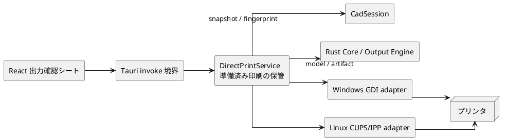
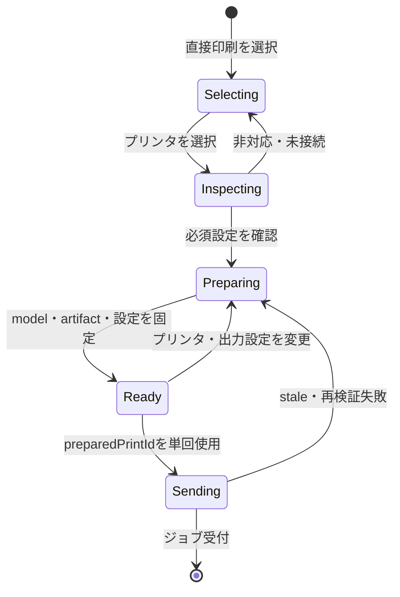
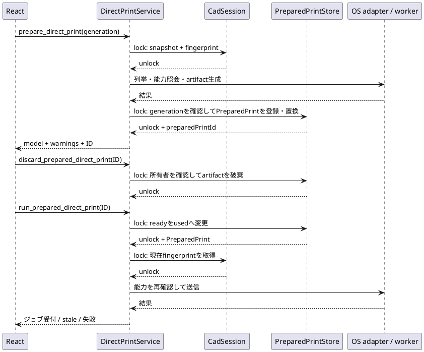

# Tauri 直接印刷設計

## 1. 目的

本書は、Tauri/React の Windows・Linux で、OS 標準の印刷設定ダイアログを使わずに A4・100%・片面の直接印刷を行うための共通境界と排他制御を定める。

Windows の GDI/DEVMODE 実装、Linux の CUPS/IPP 実装の詳細は、それぞれ OS adapter の責務とする。本書は React、Tauri backend、Core、OS adapter の接続と、最終プレビューと送信内容の一致を扱う。

Tauri/macOS は直接印刷の対象外であり、PDF 出力だけを提供する。

## 2. 到達条件

- React の出力確認シートは、利用可能な環境で PDF と直接印刷を出力先として選べる。
- プリンタが A4、片面、N-up 無効、アプリ側の自動拡大縮小なしを受け付ける場合だけ、直接印刷を開始できる。
- 利用者が確認したプレビュー、警告、印刷可能領域、出力データ、出力先、ジョブ設定は、同じ準備済み印刷に属する。
- プリンタ名、能力、準備済み印刷、OS 固有の設定は端末内の一時状態であり、`.kawa` に保存しない。
- プリンタ列挙、能力照会、印刷用データ生成、検証、ジョブ送信は、CadSession のロックを保持したまま実行しない。

100% は、KawaCAD が自動拡大縮小せずに 1 mm を OS の物理単位へ 1:1 で渡すことを表す。プリンタ本体の補正や給紙誤差は保証しない。50 mm ガイドによって実測確認できる。

## 3. 構成と責務

| 領域 | 責務 |
| --- | --- |
| React | 出力先・プリンタの選択、状態とエラーの表示、設定変更・シート終了時の準備済み印刷の破棄。印刷可能領域や倍率を推測しない。 |
| Tauri invoke 境界 | 型付きの要求・応答を React と backend の間で受け渡す。 |
| DirectPrintService | プリンタ操作の振り分け、準備済み印刷の作成・単回使用・失効・容量管理、文書と能力の再確認。 |
| CadSession | 現在の文書 snapshot と変更を所有する。プリンタ状態や OS handle を持たない。 |
| Core / Output Engine | 指定された印刷可能領域から `OutputDocumentModel` と PDF または `PrintRenderData` を生成する。 |
| OS adapter | プリンタ列挙、能力確認、印刷可能領域取得、固定設定の正規化、最終送信を行う。 |

## 4. Tauri invoke 境界

次の操作は Tauri 固有であり、`kawacad-core-process` の request 一覧には追加しない。

| 操作 | 要求 | 応答 | 用途 |
| --- | --- | --- | --- |
| `direct_print_availability` | なし | `available`、`unsupportedPlatform`、`unavailable` と理由 | 出力先に直接印刷を表示するか決める。 |
| `list_printers` | なし | プリンタ ID、表示名、選択可否 | 候補を非同期に列挙する。 |
| `inspect_printer` | `printerId`、出力設定 | A4・片面・縮小なしの可否、印刷可能領域、理由、能力 fingerprint | 選択直後に印刷可否を表示する。 |
| `prepare_direct_print` | `printerId`、出力設定、window 内で単調増加する `generation` | `preparedPrintId`、`OutputDocumentModel`、warnings、固定済み設定、印刷可能領域 | 最終プレビューと送信対象を固定する。古い generation の完了結果は保管しない。 |
| `run_prepared_direct_print` | `preparedPrintId` | ジョブ受付、または `stale` を含む失敗 | 再検証後に固定済み artifact だけを送信する。 |
| `discard_prepared_direct_print` | `preparedPrintId` | なし | 設定変更、シート終了、出力先変更時に未使用の artifact を破棄する。 |

出力設定は、ツールバーの A4 向き、寸法数値表示、50 mm ガイドを含む。回転は常に `0°` であり、直接印刷の要求には利用者指定の倍率、余白、両面、N-up を含めない。

`direct_print_availability` は Windows で `available`、Tauri/macOS で `unsupportedPlatform` を返す。Linux は CUPS/IPP を利用できるときだけ `available` を返し、libcups 不在、CUPS 未起動、権限不足では `unavailable` を返す。この結果が `available` 以外なら React は直接印刷の出力先を表示しない。

## 5. 準備済み印刷

`prepare_direct_print` は、次を一つの immutable な `PreparedPrint` として backend 内に保管する。OS の raw handle は保管しない。

- opaque な `preparedPrintId`
- 最終プレビューに返した `OutputDocumentModel` と warnings
- その model から生成した artifact（Windows は `PrintRenderData`、Linux は A4 PDF bytes）
- 出力先、正規化済みジョブ設定、印刷可能領域
- 文書 snapshot と出力設定の fingerprint
- プリンタ能力 fingerprint
- 所有する Webview window、generation、単調時計による作成時刻、60 秒の有効期限、未使用状態

`run_prepared_direct_print` と `discard_prepared_direct_print` は、作成元と同じ Webview window からの ID だけを受け付ける。実行は ID 以外の描画内容や設定を受け取らない。実行直前に現在の文書/出力設定 fingerprint とプリンタ能力 fingerprint を確認する。一つでも異なる、期限切れ、または使用済みなら `stale` を返し、ジョブを送信しない。

送信開始時に ID を使用済みにする。送信失敗後も同じ ID を再利用せず、自動再送もしない。これにより、二重クリックや応答再送で同じ印刷を複数回開始しない。

保管領域は Webview window ごとに最新 generation の未使用 `PreparedPrint` を1件だけ持つ。新しい generation を登録すると同じ window の古い artifact を即時破棄する。遅延した古い generation が後から完了しても、最新 generation を置き換えず、そのartifactを破棄して `superseded` を返す。さらに、全 window 合計の件数と artifact の総バイト数に固定上限を設け、期限切れ・破棄済みを掃除しても上限を超える場合は新規準備を `busy` として拒否する。最終プレビューを勝手に破棄しない。

PDF 保存は `PreparedPrint` を使わない。PDF と直接印刷は `OutputDocumentModel` 型と描画規則を共有するが、PDF 用の既定印刷可能領域と選択プリンタ用の印刷可能領域が異なるため、別の model を生成する。

## 6. 排他制御と処理順

`AppState` は CadSession と準備済み印刷の保管領域を分離する。CadSession のロックは snapshot と fingerprint の読み取り、または文書変更の適用だけに使う。`PreparedPrintStore` のロックは、generation を含むIDの登録・置換、明示破棄、期限切れの掃除、容量確認、`ready` から `used` への状態変更だけに使う。

次を不変条件とする。

- `spawn_blocking` または専用 worker で行うプリンタ I/O の間、CadSession と PreparedPrintStore のいずれもロックしない。
- OS adapter は、準備済み印刷へ DC、CUPS 接続、IPP request などの raw handle を保持しない。実行 worker で作り直す。
- `run_prepared_direct_print` は、PreparedPrintStore 内の状態遷移を原子的に行ってから worker を開始する。
- `PreparedPrintStore` は Webview window ごとに1件だけを保管し、件数・総artifactサイズの固定上限を越える新規準備を `busy` として拒否する。
- 文書変更は準備済み印刷を直接削除しなくてよい。実行時の fingerprint 再確認により stale として拒否する。React は設定変更とシート終了時に `discard_prepared_direct_print` を呼び、表示を更新する。
- 印刷送信後の文書編集は許可する。送信済みジョブは開始時点で固定された snapshot に基づくため、後続の編集で内容を変えない。

## 7. OS adapter の前提

Windows adapter は GDI/DEVMODE を用いる。`DocumentPropertiesW` で A4、`dmScale = 100`、片面、N-up 無効を正規化してから、`CreateDCW` と `GetDeviceCaps` で印刷可能領域を求める。`DC_DUPLEX == 0` は片面専用を表すため拒否理由にしない。実行時は同じ正規化結果を再確認し、`PrintRenderData` を 1 mm = DPI / 25.4 device unit で描画する。

Linux adapter は CUPS/IPP を用いる。対象 endpoint に対し A4、`sides=one-sided`、`print-scaling=none`、`application/pdf` の組合せを確認する。準備時と実行直前の `Validate-Job` には `ipp-attribute-fidelity=true` を指定し、unsupported、conflicting、substituted、要求値との不一致を成功扱いにしない。検証済みの PDF artifact だけを `Print-Job` へ送信する。

## 8. 検証

- PreparedPrint とプレビュー、artifact、出力先、設定の対応を確認する。
- 一つの ID が一回だけ送信でき、TTL・文書変更・出力設定変更・能力変更で stale になることを確認する。
- 同一windowの連続準備で古いartifactを破棄し、完了順が逆転しても最新generationだけを保管すること、容量上限で `busy` を返すことを確認する。
- プリンタ I/O 中に CadSession のロックを保持しないことを、adapter を差し替えるテストで確認する。
- Windows target の compile/test を行う。
- libcups がない Linux でも PDF 出力まで起動できることを確認する。
- 対応プリンタの実機で、A4・100%・片面・複数ページを確認する。

## 9. 参照

- [出力・印刷 概略設計](overview.md)
- [出力中間表現](document-model.md)
- [内部インターフェース仕様](../internal-interface-spec.md)
- [機能仕様書](../../spec/functional-spec.md)
- [UI / UX 仕様書](../../spec/ui-ux-spec.md)
