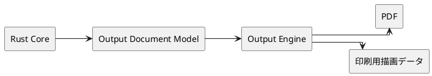
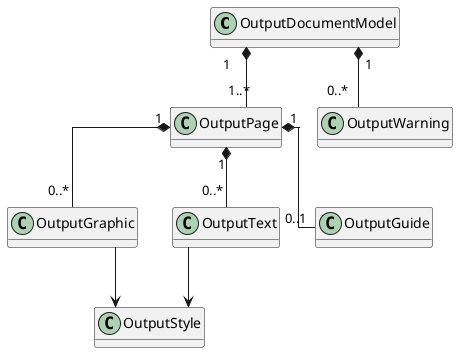

# 出力中間表現

## 1. 文書の目的

本書は、`Core + Output Engine + UI / OS Adapter` 構成のうち、Core と Output Engine の間で受け渡す出力用中間表現を整理する。

ここで扱うのは、中間表現の責務、概念構造、生成タイミング、利用先である。個別フィールドの完全な実装形状やシリアライズ方式は扱わない。

## 2. 位置づけ

出力用中間表現は、ドキュメント意味を持つ Core と、実際の出力データを組み立てる Output Engine の間に置く。

この中間表現を置く目的は次の通り。

- Core に PDF や印刷 API 依存を持ち込まない
- Output Engine にドキュメント意味判断を持ち込まない
- PDF 出力と直接印刷で同じ入力を共有する
- 将来の別出力形式追加時にも、Core の責務を増やさない

## 3. 基本方針

- 中間表現は OS 非依存とする
- 中間表現は「何をどう出すか」を表すが、「どの OS API を使うか」は表さない
- 作図座標はミリメートル基準で保持する
- 100% 実寸前提の配置結果を保持する
- 出力対象の採否、ガイド有無、寸法表示有無などは Core 側で確定させる
- Output Engine は中間表現を解釈して PDF または印刷用データへ変換する

## 4. 概念構造

### 4.1 OutputDocumentModel

OutputDocumentModel は、1回の出力要求に対する中間表現全体である。

- 用紙サイズ
- 用紙向き
- 実寸スケール
- ページ一覧
- 出力時警告一覧

初期実装では単一ページ前提だったが、現行実装ではA4単位の複数ページを同じ構造で扱う。複数ページ化の判断は `docs/design/a4-tile-output/overview.md` を参照する。

### 4.2 OutputPage

OutputPage は、1ページ分の配置結果である。

- ページ内の出力対象
- ページ内の座標系
- 印刷可能領域を前提にした配置結果

現行実装では、A4 固定、100% 実寸のページ配置を表現する。各 `OutputPage` が1ページ分の配置結果を持ち、図形座標はページ中心を原点にしたページローカル座標として扱う。

### 4.3 OutputGraphic

OutputGraphic は、図形由来の出力要素である。

- 線分
- 円
- 円弧
- 点
- 中心線

これらは、出力時に必要な線スタイルと座標を持つ。拘束マークやグリッドのような UI 補助表示は含めない。

### 4.4 OutputText

OutputText は、出力時の文字要素である。

- 寸法拘束数値表示
- ガイドの数値ラベル
- 自由テキスト

現行対象は、寸法拘束数値表示の有無切り替え、50mm ガイドのラベル、および型紙上に配置された自由テキストである。各文字要素は用途を区別できる種別を持つ。

### 4.5 OutputGuide

OutputGuide は、実寸確認用の補助要素である。

- 50mm 基準長
- 固定位置
- 数値ラベル

ガイドは常時必須ではなく、出力オプションによって含有が決まる。

### 4.6 OutputWarning

OutputWarning は、出力前に UI がユーザーへ示す判断材料である。

現行対象は次の警告である。

- 空ドキュメント
- 印刷可能領域からのはみ出し
- ページ境界またぎ
- 実寸印刷未保証

## 5. 生成と消費

### 5.1 Coreでの生成

Core は、ドキュメントと出力オプションから OutputDocumentModel を生成する。

このとき Core が担当するのは次である。

- 出力対象の選定
- レイヤー表示状態の反映
- 寸法表示有無の反映
- ガイド有無の反映
- 収まり判定
- 警告判定

### 5.2 Output Engineでの消費

Output Engine は、OutputDocumentModel を受け取り、出力先ごとのデータへ変換する。

- PDF 出力用データ
- 直接印刷用描画データ

Output Engine は、どの図形を出すか、どこに置くかを再判断しない。同じ中間表現に対して同じ描画規則を適用する。

## 6. 現行実装で含めるもの・含めないもの

### 6.1 含めるもの

- ドキュメント全体の出力対象
- 中心線
- 寸法拘束数値表示
- 50mm ガイド
- 出力時警告

### 6.2 含めないもの

- グリッド
- A4基準表示
- 拘束マーク
- 印刷ダイアログ状態
- 保存先パス
- プリンタ選択状態

## 7. 参照

- `docs/design/architecture.md`
- `docs/design/internal-interface-spec.md`
- `docs/design/output/overview.md`
- `docs/design/a4-tile-output/overview.md`
