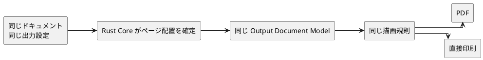
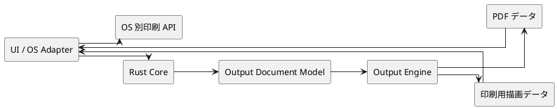
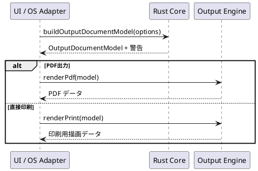

# 出力・印刷 概略設計

## 1. 目的

本書は、A4 実寸 PDF 出力と直接印刷の全体像を整理する。

扱うのは、出力対象、責務分担、警告、PDF出力と直接印刷の一致条件である。個別API、描画命令の詳細、AppKit の使い方は扱わない。

### 1.1 先に押さえる要点

1. Core が「何を、どのページの、どこへ出すか」を確定する。
2. Output Engine は確定済みの中間表現を PDF または印刷用データへ描画する。
3. Swift/macOS と Tauri/React の UI は設定・警告を扱い、図形配置を再判断しない。直接印刷はアプリ内のプリンタ選択を使い、OS の印刷設定ダイアログを表示しない。Tauri/React の直接印刷は Windows と CUPS/IPP を利用できる Linux に限り、Tauri/macOS は対象外とする。

PDF と直接印刷は、入口と出口だけが異なる。中央のページ配置と描画規則を共有することで、同じレイアウトにする。

## 2. 位置づけ

出力機能は、自由作図 CAD 基盤のドキュメントを A4 実寸 PDF または直接印刷へ変換する。

| 扱うもの | 扱わないもの |
| --- | --- |
| A4固定PDF出力 | レザークラフト固有要素 |
| アプリケーションからの直接印刷 | パーツ管理 |
| 出力用中間表現 | A4以外の用紙 |
| 空、はみ出し、実寸未保証の警告 | 重なり代付きの貼り合わせ |
| 中心線、寸法表示、50mmガイド | グリッド、A4基準表示、拘束マークの出力 |

## 3. 設計前提

- 出力対象はドキュメント全体とする。
- 用紙サイズは A4 固定、出力倍率は 100% 実寸とする。
- 用紙向きはツールバーの A4 基準表示に従う。出力時には寸法表示と50mmガイドを指定し、回転は常に `0°` とする。
- PDF出力と直接印刷は、同じ `OutputDocumentModel` 型と描画規則を共有する。選択プリンタ用の印刷可能領域で生成する中間表現は、PDF用と別の個体になり得る。
- 印刷可能領域に収まらない場合でも、自動縮小は行わない。
- A4一枚に収まらない出力対象は、`docs/design/a4-tile-output/overview.md` に従ってA4単位の複数ページとして扱う。
- 中心線は出力対象に含める。
- 非表示レイヤー、グリッド、A4基準表示、拘束マークは出力対象に含めない。

## 4. 全体構成

| 領域 | 責務 |
| --- | --- |
| UI / OS Adapter | 出力導線、設定入力、保存先選択、アプリ内プリンタ選択、警告表示、OS 別印刷 API との接続 |
| Core | 出力対象の抽出、配置、警告判定、出力用中間表現の生成 |
| Output Engine | 中間表現から PDF data と Print render data を生成 |

UI / OS Adapter は、図形の採否、実寸スケール、収まり判定を独自に決めない。Output Engine は、どの図形を出すか、どこに置くかを再判断しない。

この分担により、出力結果に差が出た場合は、次の順に原因を切り分けられる。

| 差が生じた場所 | 主に確認する領域 |
| --- | --- |
| 出力対象やページ位置が違う | Core と Output Document Model |
| PDF と印刷で線や文字の描画が違う | Output Engine の共通描画規則 |
| 保存先、印刷設定、警告表示が違う | UI / OS Adapter |

## 5. 出力用中間表現

中間表現の概念構造は `docs/design/output/document-model.md` を正とする。

中間表現には、少なくとも次を含める。

- A4ページ
- 出力対象図形
- 寸法表示
- 50mmガイド
- 警告

A4単位の複数ページ出力では、同じ `OutputDocumentModel` 内に複数の `OutputPage` を持つ。

## 6. レイアウトと警告

| 観点 | 方針 |
| --- | --- |
| 出力対象 | 表示中の図形、中心線、必要に応じた寸法表示 |
| 除外対象 | 非表示レイヤー、グリッド、A4基準表示、拘束マーク |
| 収まり判定 | 100%実寸を維持したまま印刷可能領域に収まるか判定する |
| 回転 | 常に `0°`。自動回転およびユーザー指定は行わない |
| はみ出し | 警告を返し、続行可否はユーザーが判断する |
| 空ドキュメント | 警告を返し、通常出力は完了しない |
| A4範囲外 | A4 5x5範囲内なら複数ページ化し、範囲外なら失敗する |

## 7. PDFと直接印刷の一致

PDF出力と直接印刷は、同じ入力ドキュメント、同じ `OutputDocumentModel` 型、同じ Output Engine の描画規則を使う。Tauri/React の直接印刷では、準備済み印刷へ最終プレビュー、artifact、出力先、固定設定を結び付け、実行時の再確認に成功した場合だけ送信する。

Tauri/React の共通 invoke 境界、準備済み印刷、排他制御、Windows/Linux adapter の前提は [Tauri 直接印刷設計](direct-print.md) を正とする。

## 8. Undo/Redo と保存対象

出力処理はドキュメント永続状態を変更しない。PDFファイルや印刷ジョブは Undo/Redo 対象にしない。

## 9. 参照

- `docs/README.md`
- `docs/design/architecture.md`
- `docs/design/internal-interface-spec.md`
- `docs/design/output/document-model.md`
- `docs/design/a4-tile-output/overview.md`
