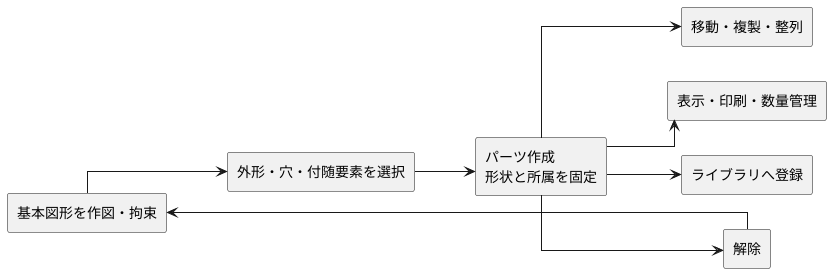
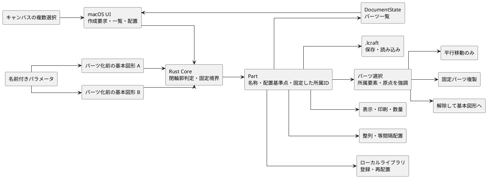
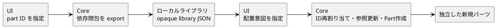
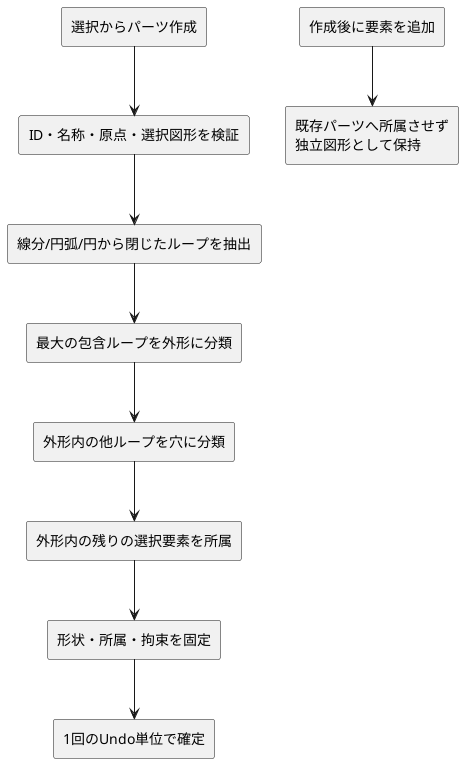
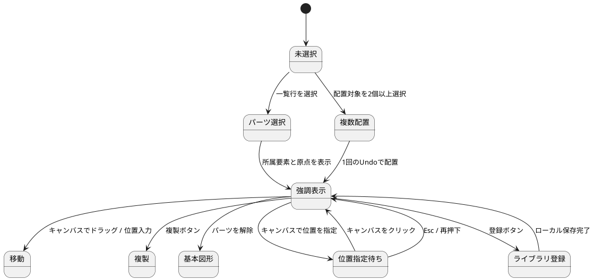

# パーツ管理 概略設計

## 1. 目的と範囲

パーツ管理では、既存の図形、派生要素、丸穴、縫い始め点、自由テキスト、計測表示を「革を切り出す単位」でまとめ、複数パーツからなる型紙を扱えるようにする。

パーツは単なる選択グループではない。**外形と穴が成立した図形集合を固定し、型紙の配置・出力・再利用の単位にしたもの**である。

### 1.1 先に押さえる要点

| 場面 | パーツの振る舞い |
| --- | --- |
| 作成 | 選択図形から外形と穴を判定し、内側の付随要素をまとめる |
| 作成後 | 名称、位置、表示、印刷対象、数量は変更できるが、個別形状は変更できない |
| 配置 | 所属要素を崩さず、まとまりとして平行移動・複製・整列する |
| 形状編集 | パーツを解除し、通常図形へ戻してから行う |
| 再利用 | ローカルライブラリへ登録し、新しい ID を持つ独立パーツとして配置する |
| 整合性 | Core が外形・穴・所属・参照を検証し、失敗時は元状態を維持する |

対象範囲は次の通り。

| 区分 | 扱うもの |
| --- | --- |
| 作成 | 名称と原点、1つの閉じた外形、外形内の複数の穴と付随要素 |
| 編集 | 名称変更、平行移動、複製、解除 |
| 管理 | 編集表示、印刷対象、製作数量 |
| 配置 | 外形基準の整列、等間隔配置 |
| 再利用 | ローカルライブラリへの登録、別プロジェクトへの配置 |
| 一貫性 | 保存・読み込み、Undo/Redo、UI/Core 境界での再現 |
| 寸法共有 | パーツ化前の複数図形による名前付きパラメータの共有 |

パーツの回転・拡大縮小、パーツ間の直接参照拘束、素材歩留まりを最適化する自動ネスティングは対象外とする。

## 2. 責務とデータの流れ

Rust Core はパーツの正本を所有する。UI は選択中の通常図形IDを作成要求として渡し、閉輪郭の判定や外形・穴の分類を行わない。

利用者が原点を明示しない場合、Core は選択図形の代表点から既定原点を決める。
絶対位置指定では UI が差分へ変換せず、希望する原点位置を Core へ渡し、
Core が現在原点との差分を求めて所属内容と原点を一体で移動する。

ライブラリ登録時は、UI がパーツ所属 ID を組み直さず、パーツ ID を Core へ渡す。Core はパーツと依存閉包を不透明なライブラリデータへ変換する。配置時も UI は配置先、名称、新しいパーツ ID だけを指定し、内部要素 ID の再割り当てと参照更新は Core が原子的に行う。

## 3. パーツの意味

パーツは次を保持する。

| 情報 | 意味 |
| --- | --- |
| ID、名称 | プロジェクト内での識別と利用者向け表示 |
| 原点 | 配置位置と平行移動差分の基準となる作図座標上の点 |
| 外形図形ID | 1つの閉じた外側ループを構成する順序付き通常図形 |
| 穴図形ID群 | 外形内の閉じた内側ループ。複数保持できる |
| 所属通常図形ID | 外形、穴、折り線、補助線、丸穴の参照先などを含む |
| 所属派生要素ID | 縫い線として利用するオフセット線など |
| 所属自由テキストID | パーツに紐づく注記 |
| 所属計測表示ID | パーツに紐づく寸法表示 |
| 表示・印刷・固定 | 編集キャンバスと出力を制御し、形状固定を表す状態 |
| 数量 | 同一形状を製作する必要数。作図形状を自動複製しない |

丸穴と縫い始め点は、それぞれ参照先の通常図形または派生要素の所属からパーツ所属を導く。寸法拘束表示は参照する拘束の対象が同じパーツに収まる場合に、そのパーツの寸法情報として扱う。

## 4. 作成と所属

円は単独で閉じたループとして扱う。線分と円弧は端点接続から閉じたループを抽出する。外形候補がない、開いた輪郭が混在する、外形の外に別の閉輪郭がある、選択済み図形が既存パーツへ所属済みの場合は作成を拒否し、元状態を維持する。

作成時には、選択図形に依存する派生要素と計測表示、および外形内の自由テキストを所属へ含める。作成後の追加要素は、固定済みパーツの構成を暗黙に変えない。

## 5. 変更と整合性

- パーツ名は空文字を許可せず、同一プロジェクト内で重複させない。
- 原点は有限の作図座標とする。
- 同じ通常図形、派生要素、自由テキスト、計測表示を複数パーツへ所属させない。
- パーツ削除はパーツのまとまりだけを解除し、図形や注記は削除しない。
- 所属要素の更新・削除、拘束・参照パラメータによる変形、所属追加・除外、外形再設定はCoreで拒否する。
- 保存読み込み時に外形、穴、所属参照が壊れている場合はファイルを拒否する。
- パーツ作成、名称更新、移動、複製、解除は既存のドキュメント履歴に含める。
- パーツ移動は所属する通常図形、自由テキスト、原点を同じ差分で移動する。派生要素、丸穴、縫い始め点、計測表示、寸法表示は参照先への追従により同じ見た目の位置関係を保つ。
- パーツ複製は所属要素とパーツ定義を新しいIDへ複製し、内部参照を複製先へ付け替える。共有パラメータと共有スタイルは複製せず参照を共有する。
- 平行移動後も各通常図形と自由テキストが原点と同じ差分だけ変化したことをCoreで検証する。回転と拡大縮小に相当する変化は拒否する。
- パーツ移動、複製、解除は、それぞれ1回のUndo単位として扱う。
- 非表示パーツの所属要素は編集キャンバスから除外し、印刷対象外パーツの所属要素はPDF・直接印刷から除外する。未所属要素には影響しない。
- パーツは常に固定し、解除可能なロック状態を設けない。名称、位置、表示、印刷対象、数量だけを変更できる。
- 数量は1以上の整数とし、保存・読み込みと複製・ライブラリ配置で維持する。数量は必要数の管理情報であり、キャンバスや出力上の形状数を暗黙に増やさない。
- 整列は2個以上、等間隔配置は3個以上のパーツを対象とし、外形の境界を基準に平行移動する。
- ライブラリ登録はパーツと依存する作図内容をローカルに保持する。配置時はIDを再割り当てし、登録元と独立したパーツとして1回のUndo単位で追加する。

## 6. UI

インスペクタの「パーツ」タブは、パーツ一覧、名称、位置、外形・穴・所属数、表示・印刷・数量、選択からの作成、複製、所属図形の選択、複数パーツ配置、ライブラリ登録・配置、パーツ解除を提供する。形状が固定されていることと、編集には解除が必要なことを表示する。

一覧行を選ぶとパーツ所属要素を選択色で強調し、原点を十字マーカーで表示する。パーツ選択中に全所属図形を選択した状態でドラッグした場合は、個別図形ではなくパーツ全体を移動する。位置指定待ちでは次のキャンバスクリックを作図座標へ変換し、その点へ原点が一致する差分だけパーツ全体を移動して通常操作へ戻る。

作成に失敗した場合は、閉じた外形が必要、外形外の図形がある、既に別パーツへ所属している、などCoreの失敗理由に対応したメッセージを表示する。固定パーツの形状編集が必要な場合はパーツ解除を案内する。

## 7. 代表受け入れ像

二つ折り財布を、札入れ、カードポケット、小銭入れ、小銭入れマチ、留め具を含む複数パーツとして管理できる。代表パーツを複製して平行移動でき、複製後も元と複製先の形状が固定される。形状編集は明示的な解除後だけ可能であり、保存・再読み込みとA4実寸出力で固定形状と配置が再現されることを受け入れ条件とする。
