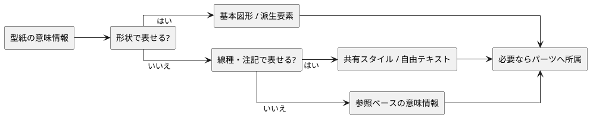
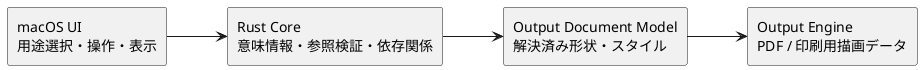

# 型紙要素の表現方針

## 1. 目的

本書は、レザークラフト固有の型紙要素を CAD 基盤上でどう表現し、どの責務へ意味情報を置くかを整理する。

個別機能の外部仕様は `docs/spec/functional-spec.md`、UI 操作は `docs/spec/ui-ux-spec.md`、保存形状は `docs/spec/file-format-spec.md` と JSON Schema を正とする。

## 2. 基本方針

型紙要素は、既存の図形、派生要素、共有スタイル、自由テキストで表現できるものを優先して再利用する。形状や見た目だけでは保存・操作・出力時の意味を再現できない場合にだけ、参照ベースの意味情報を追加する。

この方針により、同じ形状計算や出力規則を用途ごとに重複させず、ドキュメント意味は Core、描画変換は Output Engine、操作とフィードバックは UI に分担する。

## 3. 現行の表現

| 型紙要素 | 現行表現 | 追加意味情報 |
| --- | --- | --- |
| 外形カット線 | 線分・円弧などの図形 + 共有スタイル | パーツの外側ループ参照 |
| 縫い線 | 図形またはオフセット線 + 共有スタイル | 縫い始め点が対象線を参照 |
| 折り線 | 図形 + 共有スタイル | なし |
| 中心線・補助線 | 中心線または通常図形 + 共有スタイル | なし |
| 注記 | 自由テキスト | なし |
| 丸穴 | 円図形 | 穴用途と円図形 ID の参照 |
| パーツ | 既存要素のまとまり | 外形、穴、原点、所属要素、表示・印刷・数量 |

丸穴は中心や直径を重複保存せず、円図形を参照する。縫い始め点は表示座標を固定値として持たず、対象線、派生要素内 index、線上比率から再計算する。パーツも外形や穴の座標を複製せず、通常図形 ID のループとして保持する。

キャンバス描画時の縫い始め点の実座標は Core が現在の解決済み図形から求め、
表示可否とともに mm 座標の Canvas 投影へ含める。UI は保存済み比率から
実座標を再計算しない。

## 4. 責務境界

- UI は用途を選択し、Core が受け付ける意味コマンドを送る。
- Core は参照先、対象種別、重複、パーツ所属、削除時の依存関係を検証する。
- Output Engine は丸穴用途や縫い線用途を再解釈せず、Core が決めた解決済み形状とスタイルを描画する。
- `.kawa` と UI/Core 境界には、利用箇所のない汎用拡張領域を先に追加しない。

## 5. 拡張時の判断

新しい型紙要素を追加する場合は、次を順に確認する。

1. 既存図形または派生要素で形状を表現できるか。
2. 共有スタイルまたは自由テキストで用途を再現できるか。
3. 保存・読み込み、選択、編集、削除、Undo/Redo、コピー、パーツ所属、出力のどこで追加意味が必要か。
4. 追加意味が必要なら、既存要素 ID を参照する最小の構造として定義できるか。
5. UI/Core 境界、`.kawa`、JSON Schema、機能仕様、UI仕様、回帰テストを同じ変更単位で更新できるか。

## 6. 参照

- `docs/design/architecture.md`
- `docs/design/internal-interface-spec.md`
- `docs/spec/file-format-spec.md`
- `docs/spec/functional-spec.md`
- `docs/design/parts/overview.md`
- `docs/design/output/document-model.md`
