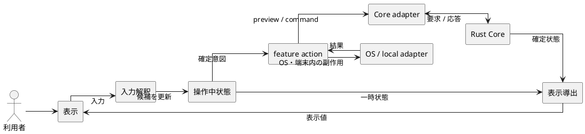
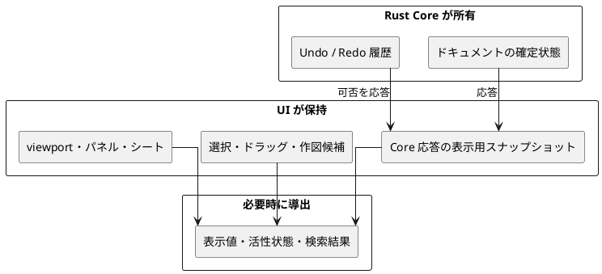

# UI アーキテクチャ

## 1. 目的

本書は、Swift/macOS UI と Tauri/React UI に共通する責務分割、状態所有、adapter 境界を定義する。個別の画面構成、クラス名、関数名、ファイル一覧は扱わない。

外部から観測できる振る舞いは `docs/spec/ui-ux-spec.md`、UI と Core が交換するデータの意味は `docs/design/internal-interface-spec.md` を正とする。UI 実装はこれらの正本を独自に複製しない。

## 2. 共通の責務モデル

UI 内の処理は、次の責務に分ける。

| 責務 | 扱う内容 | 扱わない内容 |
| --- | --- | --- |
| 表示 | Core の確定状態、操作中の候補、通知を画面へ投影する | ドキュメント状態の確定 |
| 入力解釈 | ポインタ、キーボード、メニュー操作を選択候補や操作意図へ変換する | Core の意味検証 |
| 操作中状態 | ドラッグ、矩形選択、作図候補、キャンセル可能な入力を保持する | 永続状態と Undo/Redo 履歴 |
| feature action | 操作意図を組み立て、必要な preview または確定要求を開始する | transport や OS API の具体的処理 |
| 表示導出 | 確定状態と UI 状態から表示値、活性状態、検索結果を計算する | 副作用と状態所有 |
| adapter | Core 接続、ファイル選択、端末内保存、ウィンドウなど外部境界を扱う | 画面表示と feature 固有の判断 |

重要な境界は、確定前の候補と Core が確定したドキュメント状態を混ぜないことである。キャンセルされた操作、失敗した preview、失敗した確定要求はドキュメントや Undo/Redo 履歴を変更しない。

## 3. feature-first の境界

両 UI は、フレームワークや言語の違いにかかわらず、次の論理境界を保つ。

| 境界 | 配置する責務 |
| --- | --- |
| app | entry point、composition root、feature と adapter の接続、アプリ全体のイベント |
| feature | 機能単位の表示、action、状態、表示導出、純粋な判断 |
| shared | 複数 feature が意味を変えずに利用する UI 部品と共通語彙 |
| adapter | Core、OS、設定、端末内データなど外部境界との通信 |

依存は原則として、表示から feature の action と表示導出へ、feature から抽象化された adapter 境界へ向かう。adapter から表示コンポーネントへ依存させない。app は依存を組み立てるが、feature 固有の状態や操作を再実装しない。

feature 間で連携が必要な場合は、呼び出し元が相手 feature の内部状態を直接変更せず、公開された action または読み取り専用の表示値を介する。複数 feature から利用されるという理由だけで、ドメイン上の正本を shared へ移さない。

## 4. 状態の所有

| 状態カテゴリ | 所有者 | `.kawa` 保存 | 更新規則 |
| --- | --- | --- | --- |
| ドキュメントと履歴 | Rust Core | ドキュメントだけ保存 | 成功した Core 操作だけが更新する |
| Core 応答の表示用スナップショット | UI のセッション状態 | 保存しない | Core の応答で置き換え、独自に補正しない |
| 操作中状態 | 対象 feature | 保存しない | 開始・更新・確定・キャンセルを明示する |
| 表示状態 | 対象 feature または app | 保存しない | viewport、パネル、シートなどの UI 操作で更新する |
| 表示用の導出値 | 所有しない | 保存しない | 確定状態と UI 状態から純粋に計算する |
| 端末内データ | 専用 adapter | `.kawa` には保存しない | 設定、復旧情報、ローカルライブラリごとの規則に従う |

UI は Core 応答を表示のために保持してよいが、図形、拘束、パラメータ、パーツ、dirty 状態、派生形状を別の正本として再構築しない。選択や操作中状態は Core 応答の更新後に妥当性を確認し、参照先がなくなった場合は安全に解除する。

## 5. adapter 境界

### 5.1 Core 接続

要求・応答データの意味は両 UI で共通とし、接続方法だけを adapter に閉じ込める。

| UI | 接続方法 | adapter の責務 |
| --- | --- | --- |
| Swift/macOS | `kawacad-core-process` と標準入力・標準出力で通信する | プロセスの起動と終了、要求の直列化、応答と transport 失敗の処理 |
| Tauri/React | React から invoke し、Tauri backend が同一プロセス内の `kawacad-core` を呼び出す | invoke の変換、Core セッション保持、応答と呼び出し失敗の処理 |

feature はプロセス起動、標準入出力、Tauri invoke を直接扱わない。接続方法の違いを条件分岐として表示や feature action へ持ち込まず、共通の意味を持つ要求と結果だけを利用する。

### 5.2 OS と端末内データ

次の副作用は adapter を介し、feature には結果だけを返す。

- ファイル選択、ウィンドウ状態、アプリケーション情報
- UI 設定、復旧スナップショット、ローカルライブラリの保存
- Swift/macOS の PDF 保存と直接印刷
- Tauri が提供するダイアログとローカルデータ操作

adapter は UI の表示状態を所有しない。例えばダイアログの表示可否や警告確認中かどうかは feature が持ち、adapter はダイアログの実行結果や保存結果を返す。

## 6. 設計上の不変条件

- 表示コンポーネントは表示値と action を受け取り、ドキュメントの正本を持たない。
- Core に送る前の入力補助と、Core による最終的な意味検証を区別する。
- preview は確定状態と履歴を変更せず、確定要求の成功を予約しない。
- Core 操作の失敗時は最後に確認できた表示用スナップショットを維持する。
- OS API、プロセス通信、Tauri invoke、端末内保存は adapter の外へ漏らさない。
- 表示導出は副作用を持たず、同じ入力から同じ結果を返す。
- `.kawa` と interface JSON の変更は、それぞれの仕様書と Schema を正本にする。
- アクセシビリティ識別子と利用者向け文言は、表示実装へ散在させず共通の入口から利用する。

## 7. 参照

- [`docs/design/architecture.md`](../architecture.md)
- [`docs/design/internal-interface-spec.md`](../internal-interface-spec.md)
- [`docs/spec/ui-ux-spec.md`](../../spec/ui-ux-spec.md)
- [`docs/design/interaction/selection-targets.md`](../interaction/selection-targets.md)
