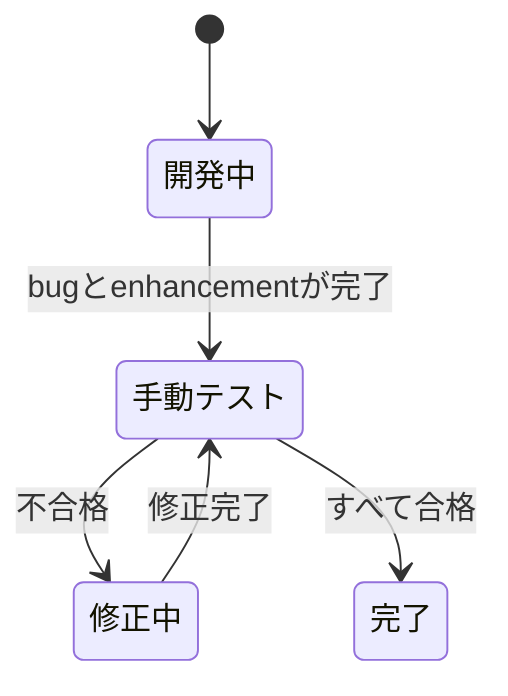

# 開発プロセス

KawaCADのIssue作成からリリースまでの進め方を定めます。

## Issue

変更の目的と概要を記載し、次のラベルを付けます。

| ラベル          | 用途                    |
| --------------- | ----------------------- |
| `enhancement`   | 機能追加、変更、改善    |
| `bug`           | 不具合の修正            |
| `documentation` | 文書のみの変更          |
| `manual_test`   | Milestone末の手動テスト |

検討の経過はIssueのコメントに残します。確定した外部仕様や設計は、`docs/spec/`または`docs/design/`へ反映します。

## Milestone

- リリース予定が決まったIssueは、`v0.x.y`形式のMilestoneに登録します。
- Milestoneの説明には、そのバージョンで導入する主な機能を記載します。
- リリース時期が未定のIssueは、`backlog`に登録します。予定が決まった時点で対象のMilestoneへ移します。

## ブランチ

作業ブランチは`main`から作成します。

| 種別                 | 名前                               |
| -------------------- | ---------------------------------- |
| 機能追加、変更、改善 | `feature/<概要>-issue-<Issue番号>` |
| 不具合修正           | `bugfix/<概要>-issue-<Issue番号>`  |
| 文書のみの変更       | `docs/<概要>-issue-<Issue番号>`    |

作業ブランチは短期間で完了させ、マージ後に削除します。当面はリリース用ブランチを作成しません。

## Pull Request

- `main`への直接pushは禁止し、作業ブランチからPull Requestを作成します。
- タイトルには、対応するIssue番号を含めます。
- 本文には、変更概要、確認内容、`Closes #123`のようなIssueを閉じる記述を含めます。
- CIが成功したことを確認してから、Squashマージします。

## 手動テスト

テストは可能な限り自動化します。自動化できない確認だけを手動テストの対象とし、Milestone末にまとめて実施します。

`v0.2.0`以降は、各Milestoneに`manual_test`ラベルのIssueを1件作成します。テスト項目はIssue本文のチェックリストにまとめ、確認条件、手順、期待結果、対象環境、結果を記載します。項目を追加した場合はコメントに経過を残し、本文にも反映します。

手動テストは、Milestone内のすべての`bug`と`enhancement`が完了してから、Milestone末に1回実施します。不合格の場合は同じMilestoneに`bug` Issueを作成し、修正後に不合格項目と影響範囲を再確認します。すべての項目が合格したら、手動テスト用Issueを完了します。

## タグ

Milestone内のIssueがすべて完了し、Pull Requestのマージと`main`のCI成功を確認した後、`main`にMilestoneと同じ`v0.x.y`形式のタグを付けます。
