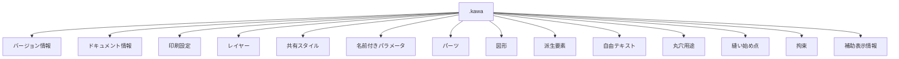

# プロジェクトファイル形式仕様書

## 1. 文書の目的

本書は、KawaCAD が使用するプロジェクトファイル `.kawa` の外形と保存方針を定義する。

ここで定めるのは、ファイルの種類、保存する情報の区分、バージョンの持ち方、互換性の考え方である。本書は意味と方針を定義し、個別フィールドの検証可能な形状は、対応する JSON Schema を正とする。

## 2. 範囲

- `.kawa` ファイルの基本構造
- 保存対象となる情報の区分
- バージョン情報
- 検証と互換性の考え方

## 3. ファイルの位置づけ

`.kawa` は、1つのプロジェクトを保存・読み込みするためのファイルである。

- 形式は JSON ベースとする
- プロジェクト全体を1ファイルにまとめる
- 画面表示専用の一時状態は保存しない
- OS や UI に依存する情報は保存対象から外す

## 4. トップレベル構造

`.kawa` には、少なくとも次の種類の情報を含める。

| 区分 | 役割 |
| --- | --- |
| メタデータ | ファイル形式やプロジェクトの識別に使う |
| ドキュメント内容 | 図形、派生要素、拘束、パラメータ、レイヤーなどの中心データ |
| 設定情報 | 用紙、向き、実寸スケール、印刷可能領域、スケールガイドに関する設定 |
| 補助表示情報 | 作図データ本体を駆動しない視覚補助 |

具体的な top-level key と各オブジェクトの形状は、schema version ごとの JSON Schema で定義する。現行 file format version は `0.1.0`、schema version は `0.1.0` であり、規範 schema は `schemas/kawa/0.1.0.schema.json` である。

現行形式では、top-level に少なくとも次の key を持つ。

| key | 役割 |
| --- | --- |
| `fileFormatVersion` | ファイル形式バージョン |
| `schemaVersion` | JSON Schema バージョン |
| `document` | プロジェクトのメタデータ |
| `settings` | 用紙と実寸印刷に関わる設定 |
| `layers` | レイヤー一覧 |
| `sharedStyles` | 図形へ適用できるプロジェクト共有スタイル一覧 |
| `parameters` | 名前付きパラメータ一覧 |
| `parts` | パーツ一覧。外形、穴、原点、構成要素の参照を保持する |
| `entities` | 図形一覧 |
| `derivedElements` | 元図形に追従する派生要素一覧 |
| `freeTexts` | 型紙上へ配置する自由テキスト注記一覧 |
| `roundHoles` | 円図形へ付与する丸穴用途一覧 |
| `stitchStartPoints` | 縫い線へ配置する縫い始め点一覧 |
| `constraints` | 拘束一覧 |
| `viewAnnotations` | 計測表示など、作図データ本体から分離した補助表示情報 |

## 5. 保存対象

### 5.1 メタデータ

メタデータには、ファイルやプロジェクトを識別するための情報を含める。

- プロジェクトID
- プロジェクト名
- 単位

ファイル形式バージョンとスキーマバージョンは、トップレベルのメタ情報として保持する。

### 5.2 ドキュメント内容

ドキュメント内容には、プロジェクトの主要な意味情報を含める。

- レイヤー
- 共有スタイル
- 図形
- 派生要素
- 自由テキスト
- 丸穴
- 縫い始め点
- 拘束
- 名前付きパラメータ
- パーツ

保存対象は、再読み込み後に同じプロジェクト状態へ戻せることを優先する。
拘束状態や自由度評価結果は、原則として図形と拘束から再評価できる派生情報として扱う。

図形座標は、画面ピクセル座標ではなく作図座標として保存する。作図座標は、用紙中心を原点とし、X正方向を右、Y正方向を上とするミリメートル単位の直交座標である。

共有スタイルは、プロジェクト単位の名前付き線スタイルとして保存する。共有スタイルは名前、線色、線幅、線種を保持する。図形と派生要素は任意で共有スタイル ID を参照でき、参照がない場合は従来どおりレイヤーの線スタイルで表示・出力される。

派生要素は、CAD基盤として元図形に追従する要素である。作成時点の通常図形へ固定せず、参照元 ID と派生要素種別ごとの指定値を保存する。派生要素は任意で共有スタイル ID を保持できる。オフセット線では距離と方向、フィレットでは半径と閉じた輪郭として扱うかどうかを保存できる。フィレット適用後の形状の一部だけをオフセット元にする場合、オフセット線はフィレット本体の ID と、その解決済み形状内で対象にする連続区間の ID を保存する。フィレットの参照元 ID は2件以上を保持できる。`closed` を省略した既存フィレットは閉じた輪郭として扱う。参照元 ID には通常図形または別の派生要素を指定できる。読み込み後の表示や出力では、保存された参照から解決済み図形を再生成する。

自由テキストは、型紙上の注記として保存する。自由テキストは表示文字列、基準位置、文字サイズを保持し、構造化メタ情報やリッチテキスト情報は保持しない。

丸穴は、円図形に付与する用途情報として保存する。丸穴は、参照する円図形 ID と、キーリング穴、カシメ穴、ジャンパーホック穴、装飾穴のいずれかの穴種別を保持する。丸穴の中心、直径、レイヤー、共有スタイルは参照先の円図形から再現する。

縫い始め点は、対象縫い線との関係として保存する。縫い始め点は、対象の通常図形 ID または派生要素 ID、派生要素内の解決済み図形 index、対象線上の位置比率を保持する。縫い始め点の表示位置と出力位置は、読み込み後に対象縫い線から再計算する。

パーツは、名称と配置基準点に加え、外側ループ、穴ループ、所属する図形、派生要素、自由テキスト、計測表示の ID、編集表示、印刷対象、固定状態、1以上の必要数量を保持する。外形と穴の座標は重複保存せず、参照先の図形から復元する。パーツを解除しても参照先の作図要素は削除しない。`locked` は互換性のため保持し、現行形式では常に `true` とする。従来ファイルで管理設定が省略されている場合、または `locked` が `false` の場合は、表示あり、印刷対象、固定状態、必要数1を各省略値として読み込む。

### 5.3 設定情報

設定情報には、保存後も再現する用紙と実寸印刷の基本情報を含める。

- A4 用紙、縦横、実寸スケール、印刷可能領域、50mm スケールガイド
- レイヤーの表示可否
- レイヤーの印刷対象可否
- レイヤーの線スタイル

グリッド、A4 基準表示、ズーム、パン、パネル開閉などの UI 表示状態は保存しない。

現行形式では、JSON Schema に定義されたフィールドだけを保存対象とし、未定義の拡張領域は持たない。

未保存変更からの自動復旧用スナップショットと、そのメタデータは `.kawa` の拡張フィールドではない。通常の保存先と分離したアプリケーション管理領域へ保存し、通常の `.kawa` を変更しない。

A4タイル出力のページ分割結果、A4グリッド上限、貼り合わせガイド、ページ番号、出力プレビュー専用のページ境界表示は保存対象にしない。これらは保存済みの作図内容、レイヤー状態、出力時オプションから出力時または表示時に生成される。

### 5.4 補助表示情報

補助表示情報は、人の視覚確認を助けるための情報であり、図形、派生要素、拘束、パラメータとは分離して保存する。

現行形式では、`viewAnnotations.measurementAnnotations` に計測表示を保存できる。計測表示は対象、ラベル位置、表示全体位置、表示可否を保存する。実測値は保存せず、読み込み後の表示時に対象図形から再計算する。

現行形式では、`viewAnnotations.dimensionConstraintAnnotations` に寸法拘束表示位置を保存できる。寸法拘束表示位置は、対象拘束 ID、ラベル位置、表示全体位置、表示可否を保存する。拘束値や target は保存せず、既存の `constraints` から参照する。

補助表示情報は、作図データ本体の意味や拘束評価を変えてはならない。参照対象が存在しない、または対象種別が成立しない場合は、図形本体の復元を妨げず、該当補助表示を整理できる。

## 6. バージョン管理

`.kawa` には、少なくとも次の2種類のバージョンを持たせる。

- ファイル形式バージョン
- スキーマバージョン

バージョンは、保存されたファイルがどの前提で作られたかを判別するために使う。

## 7. 互換性方針

現行実装が受け入れるバージョンの組み合わせは次の通り。

| `fileFormatVersion` | `schemaVersion` | 読み込み結果 |
| --- | --- | --- |
| `0.1.0` | `0.1.0` | 対応。Schema と参照整合性を検証して読み込む |
| 上記以外 | 任意 | 非対応バージョンとして拒否する |
| 任意 | 上記以外 | 非対応バージョンとして拒否する |

現行実装は、異なるバージョンからの自動変換を行わない。読み込みに成功したファイルを保存すると、現行の `fileFormatVersion` と `schemaVersion` を持つ完全な `.kawa` として出力する。

同じバージョン内では、Schema が省略値を定義している任意フィールドだけを省略できる。現行 Schema では `sharedStyles`、`freeTexts`、`roundHoles`、`stitchStartPoints`、`parts` などが該当し、省略時は空配列として扱う。個々のフィールドの省略可否と省略値は `schemas/kawa/0.1.0.schema.json` を正とする。

現行 reader は既存データの受け入れのため、`derivedElements` の省略も空配列、`viewAnnotations` の省略も空の補助表示として読み込める。現行 writer は両フィールドを常に出力する。この reader の許容範囲は、新しく生成するファイルで規範 Schema の必須条件を省略してよいことを意味しない。

互換性のために残す個別規則は本文の該当項目を正とする。現行では、フィレットの `closed` 省略を閉じた輪郭として扱い、パーツの管理設定省略または `locked: false` を現行の固定パーツ既定値へ正規化する。

将来バージョンの変換を追加する場合は、入力ファイルを上書きせず、対応元と対応先、変換できない情報、失敗時の扱いを先に仕様化する。

## 8. 検証方針

`.kawa` は、読み込み時に形式検証できることを前提とする。

- 形式が壊れている場合は読み込みを拒否する
- 必須情報が欠けている場合はエラーとする
- 参照が壊れている場合は、復元不能として扱う
- Schema に定義されないフィールドは形式の一部ではない。現行 reader が読み飛ばせる場合も保存時には保持されないため、拡張領域として利用しない

検証は、保存データの整合性を守るための仕組みであり、UI 表示とは独立する。

## 9. 参照関係の扱い

保存ファイルでは、図形、派生要素、拘束、パラメータ、パーツ、レイヤーなどの参照関係を再現できることが重要である。

- ID は安定して再現できること
- 参照は保存・読み込みで失われないこと
- 削除された対象を参照している状態は、復元時に不正として扱う

## 10. 現行バージョンでの扱い

現行バージョンでは、少なくとも次の内容を保存・読み込みできることを前提とする。

- 図形
- 派生要素
- 拘束
- 名前付きパラメータ
- レイヤーとレイヤー単位の線スタイル
- 共有スタイルと図形からの参照
- 描画や印刷に関わる基本設定
- 作図データ本体から分離された計測表示
- 複数パーツと、その外形、穴、原点、付随要素の所属関係

現行バージョンで保存・読み込みする図形は、点、線分、円、円弧、中心線とする。派生要素は、オフセット線とフィレットを保存・読み込みできる。

保存・読み込み後も、原点位置と座標軸の向きは変わらない。同じ `.kawa` ファイルを読み込んだ場合、同じ作図座標として復元される。

角度寸法拘束として利用者が指定する値は、度数法の数値として保存する。線分2本の角度拘束では、保存上の線分 `start` / `end` 方向ではなく、2線分の共有端点から各反対端点へ向かう方向を使って値を解釈する。円弧 geometry の `startAngleRad` や `sweepAngleRad` のようにフィールド名で単位を明示している低レベル表現は、そのフィールド名に従う。

計測表示の `angle` と `arcSweepAngle` も、表示時には同じ角度解釈を使う。ただし計測表示は拘束ではないため、角度値を保存せず、形状を駆動しない。

## 11. 参照

- [`functional-spec.md`](functional-spec.md)
- [`../README.md`](../README.md)
- [`../design/architecture.md`](../design/architecture.md)
- `docs/design/cad-foundation/overview.md`
- `docs/design/pattern-elements/representation.md`
- `docs/design/parts/overview.md`
- `schemas/kawa/0.1.0.schema.json`
